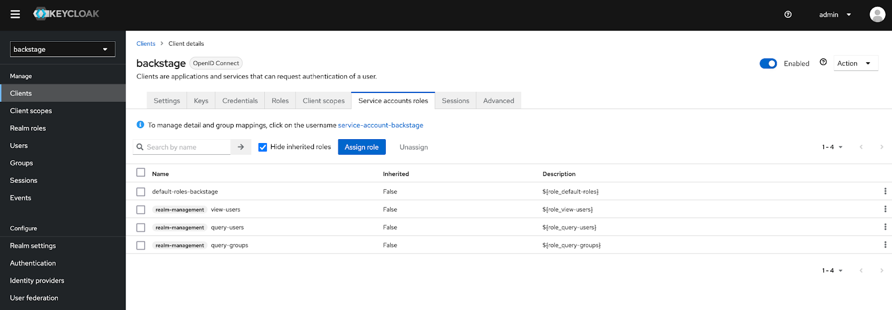
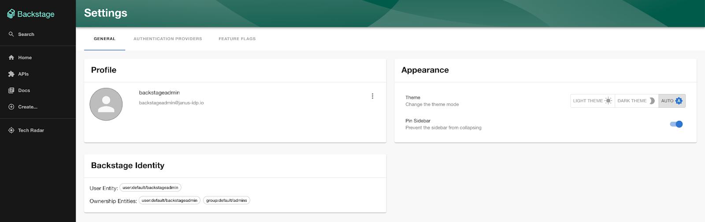

# Ingesting Keycloak Organizational Data into the Backstage Catalog

:::note
  This article is a followup to the article [Enabling Keycloak Authentication in
  Backstage](/blog/2023-01-17-enabling-keycloak-authentication-in-backstage/index.mdx). It is important that the steps
  outlined within this article are completed prior as described prior to starting this article.
:::

A directory service is a common component found in organizations big and small as it includes a facility for maintaining key assets including users, groups and their relationships. The Backstage catalog provides similar capabilities to assemble not only identity records, but other resources related to various software components. Items are added to the catalog manually or they are sourced from external locations. Several plugins associated with external providers including Azure, GitHub, GitLab and LDAP, support ingesting organizational data (Users and Groups) directly into the Backstage catalog.

In a [prior article](/blog/2023-01-17-enabling-keycloak-authentication-in-backstage/index.mdx), it was described how Keycloak can be used to act as an identity provider to store users and groups along with enforcing that users accessing Backstage authenticate against the Keycloak instance. Even though users are authenticated into Backstage, records are not added to the Backstage catalog, thus restricting the ability to fully utilize the capabilities of Backstage. Fortunately, a plugin has been developed by the Janus community to perform similar functionality as the other external providers to integrate Keycloak user and group entities into the Backstage catalog.

This article will describe the steps involved to implement its use within Backstage. The [keycloak-backend](https://github.com/janus-idp/backstage-plugins/tree/main/plugins/keycloak-backend) plugin is one of an increasing set of plugins found within the [backstage-plugins repository](https://github.com/janus-idp/backstage-plugins) that have been developed by the Janus community to expand the interoperability between Backstage and a variety of open source projects. These plugins are published within the [@janus-idp npm repository](https://www.npmjs.com/package/@janus-idp/backstage-plugin-keycloak-backend) which allows them to be added to Backstage with ease. Support for ingesting users and groups from Keycloak by way of the plugin only requires a few steps within Backstage itself.

## Backstage Configuration

The Backstage plugin to ingest Keycloak organizational data is implemented as a [backend plugin](https://backstage.io/docs/plugins/backend-plugin). Architecturally, Backstage is separated into two separate components: the _frontend_ which includes the user interface and many other user facing features, and the _backend_ which powers a variety of plugins including the software catalog. Since the purpose of a provider (plugin) is to synchronize organization data into the Backstage catalog, it is clear to see why it is implemented as a backend plugin.

Unlike the `oauth2Proxy` provider which was detailed in the prior article, the Keycloak backend plugin is not included as part of the standard installation of Backstage and must be installed. Plugins that are not included by default can be installed using the `yarn add` command.

From the Backstage root directory, execute the following command to add the Keycloak backend plugin:

```bash
yarn --cwd packages/backend add @janus-idp/backstage-plugin-keycloak-backend
```

Now that the plugin has been installed, register the plugin by adding the following content to the `packages/backend/src/plugins/catalog.ts` file.

```ts filename="packages/backend/src/plugins/catalog.ts" {2,7-17}
// ..
import { KeycloakOrgEntityProvider } from '@janus-idp/backstage-plugin-keycloak-backend';

export default async function createPlugin(env: PluginEnvironment): Promise<Router> {
  const builder = await CatalogBuilder.create(env);

  builder.addEntityProvider(
    KeycloakOrgEntityProvider.fromConfig(env.config, {
      id: 'development',
      logger: env.logger,
      schedule: env.scheduler.createScheduledTaskRunner({
        frequency: { hours: 1 },
        timeout: { minutes: 50 },
        initialDelay: { seconds: 15 },
      }),
    }),
  );

  // ..
}
```

Feel free to customize the values of the `frequency`, `timeout`, and `initialDelay` parameters as desired.

Build an updated container image according to the steps described [here](https://backstage.io/docs/deployment/docker) so that it can be deployed to a Kubernetes environment.

The Keycloak backend plugin as well as the configurations described previously are included within the reference container image is located at [quay.io/ablock/backstage-keycloak:latest](https://quay.io/repository/ablock/backstage-keycloak) if there was a desire to once again forgo producing a container image.

## Configuring Keycloak

Even though the majority of the configuration within Keycloak to populate Users, Groups and an OAuth client was completed previously, additional actions must be completed so that the Keycloak backend plugin has the necessary permissions to query the resources that are stored within the backstage Keycloak realm. Keycloak clients can be configured to act as a Service Account allowing for additional permissions to be granted to the client to query the Keycloak API.

To enable a Client to act as a Service Account, this capability, login to the Keycloak instance and navigate to the Keycloak Client created previously within the backstage realm and navigate to the **Capability config** section and check the **Service accounts roles** checkbox. Click **Save** to apply the changes.

By default, Keycloak Service Accounts are not granted the necessary permissions to obtain user and group information within the realm. Additional configurations are needed so that the Backstage Keycloak plugin can perform user and group queries.

1. Login to the Keycloak instance and navigate to the backstage OAuth client within the backstage realm. Click on the Service Account roles tab so that the necessary permissions can be associated with the OAuth client.

2. Click on the **Assign role** button to associate existing roles and enable permissions against the Keycloak Service Account.

3. Select the **Filter by realm roles** dropdown and click **Filter by clients** to display client specific roles.

4. Enter `realm-management` into the textbox in order to limit the number of values that are returned.

5. Check the following roles keeping in mind that the option to select the role may only be available within a separate page:

   - query-groups
   - query-users
   - view-users

6. Click **Assign** to add the roles to the backstage service account. Once completed, the values present within the Service accounts role tab is represented by the screenshot below.



With the necessary Service Account roles associated with the OAuth client, the Keycloak backend plugin will be able to query the necessary information from the Keycloak API.

## Backstage Kubernetes Deployment

Now that both a container image of Backstage containing the necessary components to ingest Keycloak organizational data has been created and Keycloak itself has been configured to enable the Keycloak backend plugin to query the Keycloak API, the final step is to deploy an instance of Backstage to a Kubernetes environment using the [Backstage Helm chart](https://github.com/backstage/charts/tree/main/charts/backstage).

Once again the versatility of the Backstage Helm charts allows for a wide range of options to be configured, including the ability to enable the provider by way of environment variables within the backstage container.

Create a new file called `values-backstage-keycloak-plugin.yaml` containing the Helm values that will be used to enable the Keycloak backend plugin with the following content:

```yaml filename="values-backstage-keycloak-plugin.yaml"
backstage:
  image:
    registry: quay.io
    repository: ablock/backstage-keycloak
    tag: latest
  extraEnvVars:
    - name: 'APP_CONFIG_app_baseUrl'
      value: 'https://{{ .Values.ingress.host }}'
    - name: 'APP_CONFIG_backend_baseUrl'
      value: 'https://{{ .Values.ingress.host }}'
    - name: 'APP_CONFIG_backend_cors_origin'
      value: 'https://{{ .Values.ingress.host }}'
    - name: 'APP_CONFIG_backend_cors_origin'
      value: 'https://{{ .Values.ingress.host }}'
    - name: 'APP_CONFIG_catalog_providers_keycloakOrg_default_baseUrl'
      value: '{{ required "Keycloak BaseUrl is Required" .Values.keycloak.baseUrl }}'
    - name: 'APP_CONFIG_catalog_providers_keycloakOrg_default_loginRealm'
      value: '{{ required "Keycloak Realm is Required" .Values.keycloak.realm }}'
    - name: 'APP_CONFIG_catalog_providers_keycloakOrg_default_realm'
      value: '{{ required "Keycloak Realm is Required" .Values.keycloak.realm }}'
    - name: 'APP_CONFIG_catalog_providers_keycloakOrg_default_clientId'
      value: '{{ required "Keycloak Client Secret is Required" .Values.keycloak.clientId }}'
    - name: 'APP_CONFIG_catalog_providers_keycloakOrg_default_clientSecret'
      value: '{{ required "Keycloak Client Secret is Required" .Values.keycloak.clientSecret }}'

  extraContainers:
    - name: oauth2-proxy
      env:
        - name: OAUTH2_PROXY_CLIENT_ID
          value: '{{ required "Keycloak Client Secret is Required" .Values.keycloak.clientId }}'
        - name: OAUTH2_PROXY_CLIENT_SECRET
          value: '{{ required "Keycloak Client Secret is Required" .Values.keycloak.clientSecret }}'
        - name: OAUTH2_PROXY_COOKIE_SECRET
          value: '{{ default (randAlpha 32 | lower | b64enc) .Values.keycloak.cookieSecret }}'
        - name: OAUTH2_PROXY_OIDC_ISSUER_URL
          value: '{{ required "Keycloak Issuer URL is Required" .Values.keycloak.baseUrl }}/realms/{{ required "Keycloak Realm is Required" .Values.keycloak.realm }}'
        - name: OAUTH2_PROXY_SSL_INSECURE_SKIP_VERIFY
          value: 'true'
      ports:
        - name: oauth-proxy
          containerPort: 4180
          protocol: TCP
      imagePullPolicy: IfNotPresent
      image: 'quay.io/oauth2-proxy/oauth2-proxy:latest'
      args:
        - '--provider=oidc'
        - '--email-domain=*'
        - '--upstream=http://localhost:7007'
        - '--http-address=0.0.0.0:4180'
        - '--skip-provider-button'

service:
  ports:
    backend: 4180
    targetPort: oauth-proxy

ingress:
  enabled: true
  host: backstage.example.com

keycloak:
  baseUrl: '<KEYCLOAK_URL>'
  realm: 'backstage'
  clientId: 'backstage'
  clientSecret: ''
  cookieSecret: ''
```

The Keycloak backend plugin is enabled by declaring environment variables with the prefix `APP_CONFIG_catalog_providers_keycloakOrg_default_*` and when rendered at runtime take a form similar to the following:

```yaml
catalog:
  providers:
    keycloakOrg:
      default:
        baseUrl: <BASE_URL>
        loginRealm: <KEYCLOAK_LOGIN_REALM>
        realm: <KEYCLOAK_REALM>
        clientId: <KEYCLOAK_CLIENTID>
        clientSecret: <KEYCLOAK_CLIENTSECRET>
```

Several fields require that the parameters be provided either within the Values file itself or as parameters using the `--set` option when deploying the chart.

Update the `keycloak.baseUrl` parameter to reference the location of the Keycloak instance along with specifying the backstage OAuth client secret within the `keycloak.clientSecret` parameter. In addition, specify the hostname of the backstage instance within the `ingress.host` property. If a container image was created that includes the configurations to support not only the Keycloak backend plugin as well as OAuth integration as described in the previous article, specify the details within the `backstage.image` property.

With the necessary parameters configured, perform an upgrade of the Backstage helm chart by executing the following command. If an existing release does not already exist, the inclusion of the `-i` parameter ensures that it will be installed.

```bash
helm upgrade -i -n backstage --create-namespace backstage
backstage/backstage -f values-backstage-keycloak-plugin.yaml
```

:::note
  If the Backstage Helm chart was previously installed with persistence enabled using a random
  password generation strategy, the chart must be uninstalled first.
:::

Once the release is complete, the Backstage user interface can be accessed via the created Ingress and continues to be governed by Keycloak based OAuth authentication. However, if the log from the Backstage container is inspected, the Keycloak backend plugin can be seen in action.

Execute the following command to view the Backstage container log:

```bash
kubectl -n backstage logs deployment/backstage
```

```
2022-12-24T23:24:36.299Z catalog info Reading Keycloak users and groups type=plugin class=KeycloakOrgEntityProvider taskId=KeycloakOrgEntityProvider:default:refresh taskInstanceId=a8c1693c-b5cb-439a-866d-c1b6b7754a77
2022-12-24T23:24:36.382Z catalog info Read 2 Keycloak users and 2 Keycloak groups in 0.1 seconds. Committing... type=plugin class=KeycloakOrgEntityProvider taskId=KeycloakOrgEntityProvider:default:refresh taskInstanceId=a8c1693c-b5cb-439a-866d-c1b6b7754a77
2022-12-24T23:24:36.386Z catalog info **Committed 2 Keycloak users and 2 Keycloak groups in 0.0 seconds.** type=plugin class=KeycloakOrgEntityProvider taskId=KeycloakOrgEntityProvider:default:refresh taskInstanceId=a8c1693c-b5cb-439a-866d-c1b6b7754a77
```

Observe in the container log that the plugin identified two users and two groups from the Keycloak realm which have been imported into the backstage catalog. The contents of the Backstage catalog can be inspected by querying the Backstage API. Execute the following command to execute a command within the Backstage pod to query the API and format the results using [jq](https://stedolan.github.io/jq/). If `jq` is not installed on the local machine, it can be removed from the command.

```bash
kubectl -n backstage exec -c oauth2-proxy deployment/backstage -- wget -q --output-document - "http://localhost:7007/api/catalog/entities?filter=kind=user" | jq -r

[
  {
    "metadata": {
      "namespace": "default",
      "annotations": {
        "backstage.io/managed-by-location": "url:https://keycloak.apps.cluster-cmwgv.cmwgv.sandbox2741.opentlc.com/admin/realms/backstage/users/1e703d12-cb09-4c7e-b615-7ea620725006",
        "backstage.io/managed-by-origin-location": "url:https://keycloak.apps.cluster-cmwgv.cmwgv.sandbox2741.opentlc.com/admin/realms/backstage/users/1e703d12-cb09-4c7e-b615-7ea620725006",
        "backstage.io/view-url": "https://keycloak.apps.cluster-cmwgv.cmwgv.sandbox2741.opentlc.com/admin/realms/backstage/users/1e703d12-cb09-4c7e-b615-7ea620725006",
        "keycloak.org/id": "1e703d12-cb09-4c7e-b615-7ea620725006",
        "keycloak.org/realm": "backstage"
      },
      "name": "backstageadmin",
      "uid": "25f4a1bb-e035-4f3a-b618-4d16876325d7",
      "etag": "ab5c4076701c76d9a6215a9f7e2fd5b1e6035790"
    },
    "apiVersion": "backstage.io/v1beta1",
    "kind": "User",
    "spec": {
      "profile": {
        "email": "backstageadmin@janus-idp.io",
        "displayName": "Backstage Admin"
      },
      "memberOf": [
        "Admins"
      ]
    },
    "relations": [
      {
        "type": "memberOf",
        "targetRef": "group:default/admins",
        "target": {
          "kind": "group",
          "namespace": "default",
          "name": "admins"
        }
      }
    ]
  },
  {
    "metadata": {
      "namespace": "default",
      "annotations": {
        "backstage.io/managed-by-location": "url:https://keycloak.apps.cluster-cmwgv.cmwgv.sandbox2741.opentlc.com/admin/realms/backstage/users/90625bf5-5e63-434e-96b7-288908907134",
        "backstage.io/managed-by-origin-location": "url:https://keycloak.apps.cluster-cmwgv.cmwgv.sandbox2741.opentlc.com/admin/realms/backstage/users/90625bf5-5e63-434e-96b7-288908907134",
        "backstage.io/view-url": "https://keycloak.apps.cluster-cmwgv.cmwgv.sandbox2741.opentlc.com/admin/realms/backstage/users/90625bf5-5e63-434e-96b7-288908907134",
        "keycloak.org/id": "90625bf5-5e63-434e-96b7-288908907134",
        "keycloak.org/realm": "backstage"
      },
      "name": "backstageuser",
      "uid": "96f3f8a1-aaa2-4d4c-89dc-b3e5d22aa049",
      "etag": "ad2d9c10fbfad74bb685ad10fdca178b2869516c"
    },
    "apiVersion": "backstage.io/v1beta1",
    "kind": "User",
    "spec": {
      "profile": {
        "email": "backstageuser@janus-idp.io",
        "displayName": "Backstage User"
      },
      "memberOf": [
        "Users"
      ]
    },
    "relations": [
      {
        "type": "memberOf",
        "targetRef": "group:default/users",
        "target": {
          "kind": "group",
          "namespace": "default",
          "name": "users"
        }
      }
    ]
  }
]
```

Observe that the relationships between users and groups are also present. Groups imported to the catalog can be inspected by executing the following command to invoke the Backstage API:

```bash
kubectl -n backstage exec -c oauth2-proxy deployment/backstage -- wget -q --output-document - "http://localhost:7007/api/catalog/entities?filter=kind=group" | jq -r
```

Now that the Backstage catalog has been populated, additional metadata will now be associated with users when they authenticate to the Backstage user interface. Launch a web browser and navigate to the Backstage user interface and login using either of the previously created Keycloak users.

Click on the **Settings** button on the bottom left corner of the page. Ensure the additional relationship details (groups) are present to confirm that the authenticated user has been linked properly to the user in the catalog.



The Keycloak backend plugin will run periodically based on the parameters defined within the `catalog.ts` file to ensure that the Backstage catalog is updated with the current state as defined within keycloak. By providing the capability to ingest organizational data into the Backstage catalog from Keycloak, the benefits that are offered through the use of Keycloak as an identity source can be realized within Backstage.
