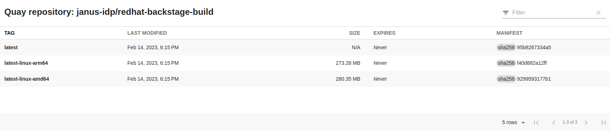

# Exploring Quay registry in Backstage

The Janus IDP family of Backstage plugins is expanding! Please welcome our new member - a frontend plugin that enriches application view in Backstage with insights from a Quay hosted registry.

Backstage models the software ecosystem as [Backstage Catalog](https://backstage.io/docs/features/software-catalog/software-catalog-overview) entities. Users compose small individual service components into a bigger picture. And in order to truly understand and fully describe the individual building blocks, Backstage users construct views to capture different aspects of these components; from technical documentation, through dependencies and relation to deployment state, CI and CD. And part of this picture is understanding what is actually being deployed into live environments. In many cases, the deployment artifact is a container image and the desire to view all of the available and deployed container images. This new Quay plugin for Backstage brings in that capability.

Quay is an OCI-compatible registry that allows users to build, store and distribute container images and other OCI artifacts. It is available as a hosted service on quay.io as well as a self-hosted environment deployable to any OpenShift cluster through a Quay operator. 


## Installation and setup

With this plugin, viewing available container images in a particular repository is easy. The following guide will elaborate in detail on individual steps for enabling the integration and all currently supported settings and options.

First, it is necessary to install the plugin. Please add it to the frontend of your Backstage instance:

```bash
yarn workspace app add @janus-idp/backstage-plugin-quay
```

### Connecting to Quay registry via Proxy

The plugin leverages the Backstage native proxy capabilities to query the Quay API; therefore, configurations need to be made to the `app-config.yaml`. In order to connect the Backstage instance to the public hosted Quay.io environment, the following configuration can be used:

```yaml filename="app-config.yaml"
proxy:
  '/quay/api':
    target: 'https://quay.io'
    changeOrigin: true
    headers:
      X-Requested-With: 'XMLHttpRequest'
```

When accessing private Quay repositories, it may be necessary to extend this configuration with an `Authorization` header and Quay API token. This token can be obtained by creating a Quay Application using the [steps outlined in this documentation](https://docs.quay.io/api/#applications-and-tokens). Once a token is obtained, the header can be set by extending the `app-config.yaml` setup above with an additional header:

```yaml {7} filename="app-config.yaml"
proxy:
  '/quay/api':
    target: 'https://quay.io'
    changeOrigin: true
    headers:
      X-Requested-With: 'XMLHttpRequest'
      Authorization: 'Bearer ${QUAY_TOKEN}'
```

Be aware that the `QUAY_TOKEN` is an environment variable that has to be available to the Backstage instance at runtime.

Another popular option is to be able to target a self-hosted Quay deployment. This can be achieved by simply changing the `target` property in the settings above with the location of the Quay instance. In addition, if the self-hosted Quay registry is also deployed with a certificate that is not in the certificate chain of trust for the Backstage instance, the `secure` option has to be unset.

```yaml {3,8} filename="app-config.yaml"
proxy:
  '/quay/api':
    target: '<SELF_HOSTED_QUAY_ENDPOINT>'
    changeOrigin: true
    headers:
      X-Requested-With: 'XMLHttpRequest'
      Authorization: 'Bearer ${QUAY_TOKEN}'
    secure: [true|false]
```

More details on available Backstage proxy settings can be found in the [upstream documentation](https://backstage.io/docs/plugins/proxying). 

This plugin conforms to the pattern used by many other Backstage plugins that use the Backstage proxy and provides a mechanism to change the default proxy path `/quay/api` via the following `app-config.yaml` settings, if needed:

```yaml filename="app-config.yaml"
quay:
  proxyPath: /custom/quay/path
```

### Enabling Quay plugin widget in UI

Now that the plugin is configured to access the desired Quay registry, enable the UI by enabling an additional view in the frontend application.(`packages/app/src/components/catalog/EntityPage.tsx` file in the bootstrap application)

```tsx filename="packages/app/src/components/catalog/EntityPage.tsx"
import { QuayPage, isQuayAvailable } from '@janus-idp/backstage-plugin-quay';

const serviceEntityPage = (
  <EntityPageLayout>
    // ...
    <EntityLayout.Route if={isQuayAvailable} path="/quay" title="Quay">
      <QuayPage />
    </EntityLayout.Route>
  </EntityPageLayout>
);
```

## Using the plugin

Finally, after the plugin is fully set up, it needs to be instructed on what data to display for individual catalog entities. Extend the entity with an annotation, a similar experience Backstage users are used to with other plugins:

```yaml
metadata:
  annotations:
    'quay.io/repository-slug': '<ORGANIZATION>/<REPOSITORY>'
```

For example, if we annotate a `Component` with `'quay.io/repository-slug': 'janus-idp/redhat-backstage-build'`, we are presented with the following page:




## Next steps

Although this plugin doesn’t have the vast features available in the Quay UI, it brings much-needed value to Backstage users.  In the future, we plan to iterate on this plugin and provide users with more insights into unique Quay functions like vulnerability scanning and detailed manifest views.

To contribute to this plugin, report issues, seek guidance or provide feedback, please see our GitHub repository [https://github.com/janus-idp/backstage-plugins/tree/main/plugins/quay](https://github.com/janus-idp/backstage-plugins/tree/main/plugins/quay) and/or reach out to us on [Janus IDP Slack](https://join.slack.com/t/janus-idp/shared_invite/zt-1nii16o6e-SGscZ4YtAktL6rRtZZBUfA).
