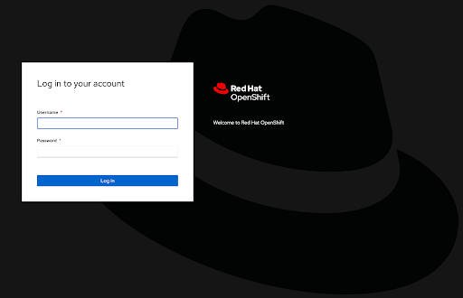
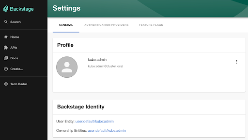

# Using OpenShift Authentication to Secure Access to Backstage

Backstage is a tool for building Internal Development Platforms and includes the flexibility to be deployed within a variety of operating environments, including containers. In prior articles, it was introduced how the deployment of Backstage within Kubernetes environments can be streamlined through the use of the [Backstage Helm chart](https://github.com/backstage/charts/tree/main/charts/backstage) as well as integrating the platform into identity stores, such as Keycloak. OpenShift is a common deployment target for running Backstage as it provides enterprise grade container orchestration and one of its capabilities is the  ability to integrate with a variety of Identity Providers. Since many users of Backstage also use OpenShift to build and deploy containerized workloads, there is a desire to more closely tie into existing workflows and access models. This article introduces how Backstage can be integrated with OpenShift’s existing authentication capabilities to provide a seamless path for users to access the Backstage portal.

In addition to the base platform, OpenShift also includes a number of additional features that enhance not only how administrators, but developers work with the platform and include those that support GitOps and multicluster workflows just to name a few. Many of these same components also provide their own user interface which expose their capabilities. To enable ease of use, access is granted using the same authentication mechanisms as the OpenShift cluster itself using a workflow similar to the native OpenShift console. The ability to authenticate to applications using the same set of credentials as OpenShift itself is facilitated through the [OpenShift oauth-proxy](https://github.com/openshift/oauth-proxy) -- a separate container running within the same pod, using the sidecar pattern, which intercepts requests and interacts with the OpenShift platform to restrict access to facilitate the authentication process.

## Enabling OpenShift Authentication

As described in the article, [Enabling Keycloak Authentication in Backstage](blog/2023-01-17-enabling-keycloak-authentication-in-backstage/index.mdx), support is available within Backstage to utilize an OAuth proxy container to restrict access to the platform. The same approach can be used for OpenShift as well. The key difference is that instead of using a [generic oauth2-proxy](https://github.com/oauth2-proxy/oauth2-proxy) container, the OpenShift oauth-proxy container is used as it has features designed specifically for OpenShift. Thanks to the versatility of the Backstage Helm chart, the other changes that need to be made to enable this feature is to the content of the Values.

Generally, the use of the OpenShift OAuth proxy requires the following to be configured:

1. An OAuth client to communicate with OpenShift
2. TLS certificates to expose the OAuth container
3. Configure the Route that is exposed by the OpenShift ingress router

Let’s describe how to enable each of these configurations.

### OAuth Client Configuration

OpenShift provides two methods for registering a new OAuth client:

1. Creating a OAuthClient Custom Resource
2. Using a Service Account as an OAuth client

The former is commonly used by cluster services, such as the OpenShift web console, but has the disadvantage of a cluster scoped resource, thus requiring elevated access. The latter is more applicable in this use case as a standard OpenShift Service Account can perform the function of acting as an OAuth client. All that is required to enable such functionality is adding an annotation with the key `serviceaccounts.openshift.io/oauth-redirecturi.<name>` to the Service Account with the location of the redirect URI. For the case of the OpenShift OAuth proxy, it would be at the `/oauth/callback` context path.

This capability can be enabled by setting the following Helm values.

```yaml
serviceAccount:
  create: true
  annotations:
    serviceaccounts.openshift.io/oauth-redirecturi.backstage: "https://{{ .Values.ingress.host }}/oauth/callback"
```

### TLS Certificate Management

There are multiple methods for which TLS certificates can be configured within OpenShift. They could be provided by the end user or by way of an operator, such as [cert-manager](https://docs.openshift.com/container-platform/4.12/security/cert_manager_operator/cert-manager-operator-install.html), which can integrate with an external certificate management tool or generate certificates of its own. OpenShift also includes support for automatically generating and injecting certificates into applications through the [Service Serving Certificate](https://docs.openshift.com/container-platform/4.12/security/certificates/service-serving-certificate.html) feature. The `service-ca` monitors annotations placed upon OpenShift `Service` resources. When a Service with the annotation `service.beta.openshift.io/serving-cert-secret-name=&lt;name>` is created, the controller generates a certificate and its associated private key within a `Secret`.

To have OpenShift generate certificate within a Secret called `backstage-tls` which can be configured within the OAuth proxy, the following Helm values can be specified:

```yaml
service:
  annotations:
    service.alpha.openshift.io/serving-cert-secret-name: backstage-tls
```

### Ingress Configuration

The ability to expose applications running within OpenShift externally has been one of the most compelling features included within OpenShift ever since the early days of version 3. `Routes`, the predecessor to the native Kubernetes `Ingress` resource, has enabled such functionality and it continues to this day. However, more and more applications are favoring the native Kubernetes `Ingress` option over the OpenShift specific `Route`.

Fortunately, OpenShift can automatically "upconvert" Kubernetes native `Ingress` resources to OpenShift `Routes`. In addition, the upconversion can be customized. In particular, the TLS termination type to configure end-to-end secure transport. As described in the prior section, the OAuth proxy is secured using a certificate provided by the Service Serving Certificate feature. While this certificate is generated by a Certificate Authority that is trusted within OpenShift, end users would not be able to trust such certificates.

To work around this challenge, the generated `Route` that is created from an `Ingress` resource can be configured with a TLS termination type of `reencrypt`. TLS communication is terminated at the Ingress router and reencrypted for transport to the underlying pod. Since OpenShift assets trust the certificate that is used by the service-ca controller, trust is established for the final leg of communication enabling a fully trusted path from client to server.

Similar to the enablement of the Service Account as a OAuth Client and the Service Service Certificate feature, an annotation can be placed on an `Ingress` resource with the key `route.openshift.io/termination` with the value of `reencrypt` to set up the `Route` to expose the Backstage instance. 

The following Helm values can be specified to configure the `Ingress` resource:

```yaml
ingress:
  enabled: true
  host: backstage.apps.example.com
  annotations:
    route.openshift.io/termination: "reencrypt"
```

## Deploying the Backstage Helm Chart

With the primary changes called out, the final step is to declare the full set of customized Helm values and to deploy the instance of Backstage using the Backstage Helm chart.

Create a file called `values-backstage-openshift-auth.yaml` with the following content:

```yaml filename="values-backstage-openshift-auth.yaml"
backstage:
  image:
    registry: quay.io
    repository: ablock/backstage-oauth
    tag: latest
  extraEnvVars:
    - name: "APP_CONFIG_app_baseUrl"
      value: "https://{{ .Values.ingress.host }}"
    - name: "APP_CONFIG_backend_baseUrl"
      value: "https://{{ .Values.ingress.host }}"
    - name: "APP_CONFIG_backend_cors_origin"
      value: "https://{{ .Values.ingress.host }}"
  installDir: /opt/app-root/src

  extraContainers:
    - name: oauth-proxy 
      args:
        - -provider=openshift
        - -https-address=:8888
        - -http-address=
        - -email-domain=*
        - -upstream=http://localhost:7007
        - -tls-cert=/etc/tls/private/tls.crt
        - -tls-key=/etc/tls/private/tls.key
        - -cookie-secret="{{ default (randAlpha 32 | lower | b64enc) .Values.oauthProxy.cookieSecret }}"
        - -openshift-service-account={{ include "common.names.fullname" . }}
        - -openshift-ca=/var/run/secrets/kubernetes.io/serviceaccount/ca.crt
        - -skip-auth-regex=^/metrics
        - -skip-provider-button
        - -request-logging=true
      image: registry.redhat.io/openshift4/ose-oauth-proxy:v4.12
      imagePullPolicy: IfNotPresent
      ports:
        - name: oauth-proxy
          containerPort: 8888    
          protocol: TCP
      volumeMounts:
        - mountPath: /etc/tls/private
          name: backstage-tls

  extraVolumeMounts:
    - mountPath: /tmp/fakepath
      name: backstage-tls

  extraVolumes:
    - name: backstage-tls
      secret:
        defaultMode: 420
        secretName: backstage-tls

service:
  annotations:
    service.alpha.openshift.io/serving-cert-secret-name: backstage-tls
  ports:
    backend: 8888
    targetPort: oauth-proxy

serviceAccount:
  create: true
  annotations:
    serviceaccounts.openshift.io/oauth-redirecturi.backstage: "https://{{ .Values.ingress.host }}/oauth/callback"

ingress:
  enabled: true
  host: backstage.apps.example.com
  annotations:
    route.openshift.io/termination: "reencrypt"

oauthProxy:
  cookieSecret: ""
```

Be sure to update the `ingress.host` property with the desired exposed hostname for Backstage.

The majority of the values have been reused from prior articles on this subject aside from those that were highlighted in the previous sections as well as the `extraContainers` property which contains the definition for the oauth-proxy container. Also note that none of the customizations as it pertains to the PostgreSQL database supporting Backstage has been defined either resulting in an ephemeral deployment for demonstration purposes. Consult the prior articles, specifically [Exploring the Flexibility of the Backstage Helm Chart](blog/2023-01-25-exploring-the-flexibility-of-the-backstage-helm-chart/index.mdx), for steps on how to customize the Backstage deploying using the Helm chart along with configuring your machine with the necessary Helm dependencies.

Install the chart by executing the following command:

```bash
helm install -n backstage --create-namespace backstage backstage/backstage -f values-backstage-openshift-auth.yaml
```

Once the chart has been installed, open a web browser and navigate to the hostname as defined by the hostname within the Ingress resource. You should be presented with the familiar OpenShift login page for which you may be able to select the appropriate identity provider (if multiple are defined) as well as providing your credentials to complete the authentication process. 



Once authenticated, you will be presented with the Backstage dashboard. Click the **Settings** button on the bottom left side of the page to view information related to the current authenticated user to confirm the integration with OpenShift was successful.



With minimal effort whatsoever and by modifying a few values within the Backstage Helm chart, Backstage was secured. Only those with accounts in OpenShift have the ability to access the portal. When used in conjunction with other integrations, such as the importing of organizational details from external sources, features and capabilities within Backstage can be enabled based on their access level, providing a simplified user experience that enables productivity. 
