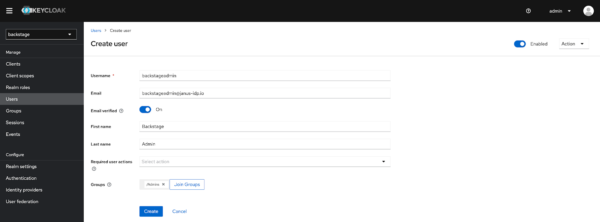
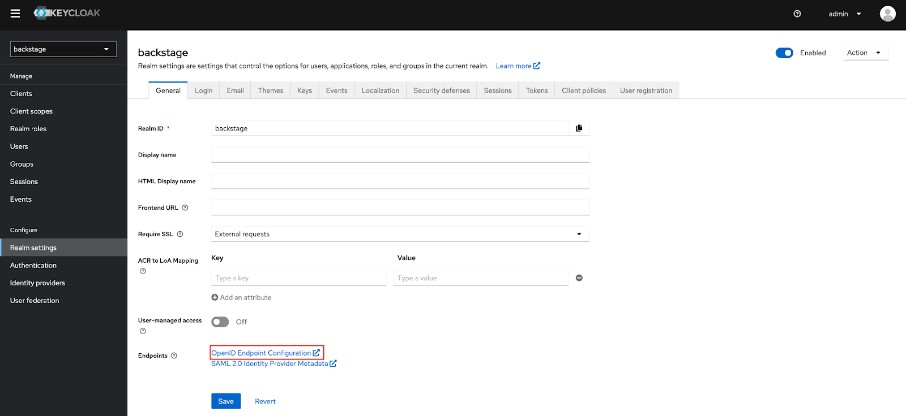
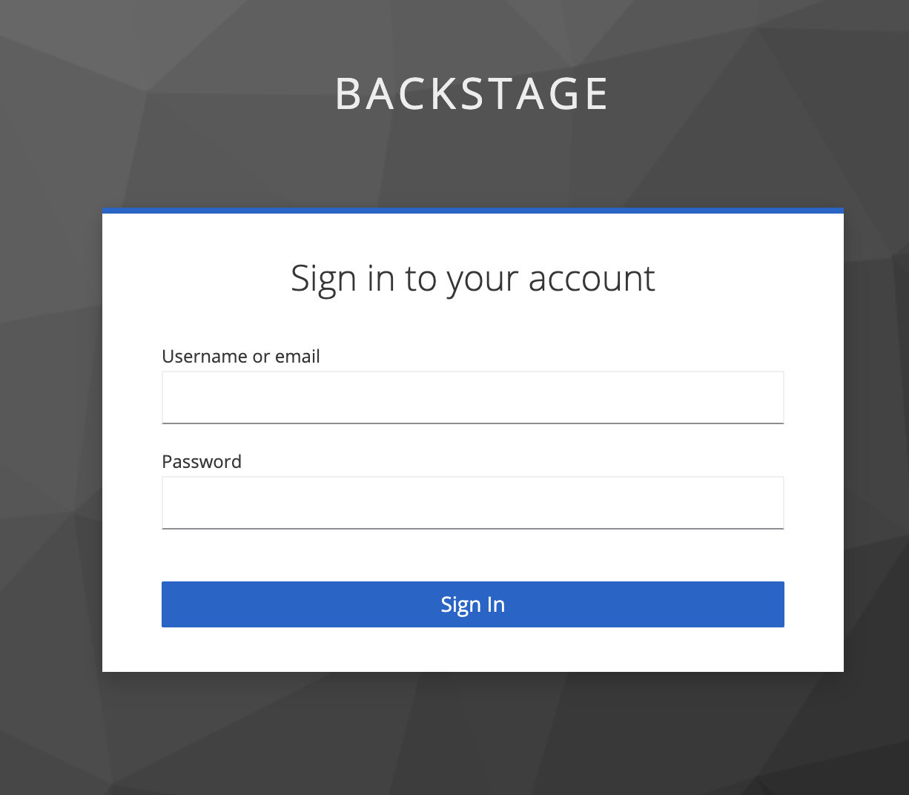
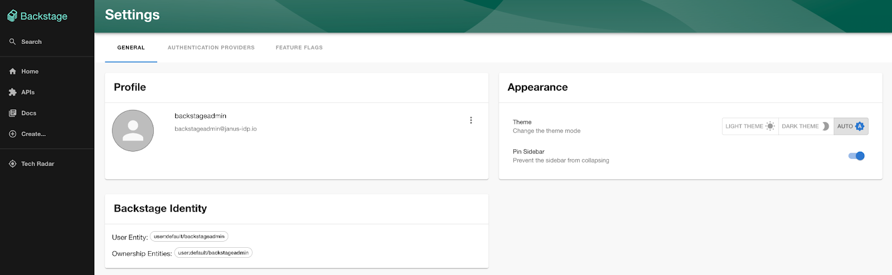

# Enabling Keycloak Authentication in Backstage

The software catalog is the heart of Backstage as it provides a centralized mechanism for organizing all of the assets within a particular domain. This content can include everything from services, websites, pipelines and everything in between and the catalog provides a facility for managing these assets in a declarative fashion along with assigning ownership against them. Identity records within Backstage are represented as Users (individual entities) and Groups (a collection of users) and they enable the association of ownership and policies to resources within the software catalog. The determination of who the user is and their association to a User entity within the software catalog is the core functionality of the authentication system within Backstage. Every installation of Backstage includes a number of [built-in](https://backstage.io/docs/auth/#built-in-authentication-providers) authentication providers, and while GitHub is the most common, several alternatives are available to choose from including GitLab, Google and Azure.

Keycloak is an Open Source identity and access management tool and provides capabilities including Single Sign On (SSO), user management and support for fine grained authorization policies. In addition to these features, one of the biggest benefits of Keycloak is that it can federate identities from other external providers including many of the built-in authentication providers within Backstage. By integrating Backstage with Keycloak, a single source of truth as it relates to identity can be attained. The benefits include avoiding the process of having to manage multiple authentication providers along with allowing for a more “cloud native” method of authentication and authorization using the OpenID Connect (OIDC) protocol. Enabling users to authenticate against Keycloak to gain access to Backstage is a straightforward process and will be described throughout the remainder of this article.

Prior to performing any configuration within either Keycloak or Backstage, the first step is to better understand the architecture and the overall process. Unlike other providers, such as those that were introduced previously (GitHub, Google, etc), there is no direct integration between Backstage and Keycloak. Instead, the [OAuth2 proxy provider](https://backstage.io/docs/auth/oauth2-proxy/provider) is implemented through the use of the [oauth2-proxy](https://github.com/oauth2-proxy/oauth2-proxy) to act as an intermediate for offloading the entire authentication process which passes the resulting request for Backstage to process. An overview of the entire flow is described below:

1. OIDC client is created within Keycloak representing the integration with Backstage and configured within the OAuth2 proxy.
2. Users attempts to access Backstage and is redirected to Keycloak by the OAuth2 proxy
3. User authenticates against Keycloak
4. Upon successful authentication to Keycloak, OAuth process verifies user has met all necessary requirements that are needed to access Backstage
5. Request to Backstage for the processing of the authentication
6. Backstage [Sign In Resolver](https://backstage.io/docs/auth/identity-resolver) ingests request (reading headers provided by the OAuth2 proxy) and either associates the user within an existing entry in the software catalog or a new entry is created
7. Authentication process is complete and the user can make use of Backstage based on their level of access

As this list illustrates, there are several steps involved to enable Backstage users to authenticate against Keycloak. The first step is to set up Backstage with the necessary configurations to enable the OAuth2 provider.

## Backstage Configuration

Similar to the other authentication providers that are included with Backstage, there are steps that must be completed within Backstage itself to support using Keycloak authentication by way of the OAuth 2 Proxy Provider including:

- Adding the provider to the Backstage frontend
- Updating the Backstage app-config.yaml configuration file to enable the OAuth2 Proxy Provider
- Configuring a Sign in Resolver within the Backstage backend

First, update the Backstage frontend by enabling the `ProxiedSignInPage` by making the following changes in the `packages/app/src/App.tsx` file:

```tsx filename="packages/app/src/App.tsx" {1,5-7}
import { ProxiedSignInPage } from '@backstage/core-components';

const app = createApp({
  // ...
  components: {
    SignInPage: (props) => <ProxiedSignInPage {...props} provider="oauth2Proxy" />,
  },
});
```

Next, add the `oauth2Proxy` to the list of authentication providers within the Backstage `app-config.yaml` configuration file:

```yaml filename="app-config.yaml"
auth:
  providers:
    oauth2Proxy: {}
```

The final required configuration within backstage is to set up an [Identity Resolver](https://backstage.io/docs/auth/identity-resolver) which will translate the parameters (headers) that are received from the OAuth2 proxy and translate them into an authenticated backstage user.
Update the `packages/backend/src/plugins/auth.ts` file with the following content:

```ts filename="packages/backend/src/plugins/auth.ts" {1,9-40}
import { DEFAULT_NAMESPACE, stringifyEntityRef } from '@backstage/catalog-model';

export default async function createPlugin(env: PluginEnvironment): Promise<Router> {
  return await createRouter({
    // ...
    providerFactories: {
      ...defaultAuthProviderFactories,
      // ...
      oauth2Proxy: providers.oauth2Proxy.create({
        signIn: {
          async resolver({ result }, ctx) {
            const name = result.getHeader('x-forwarded-preferred-username');
            if (!name) {
              throw new Error('Request did not contain a user');
            }

            try {
              // Attempts to sign in existing user
              const signedInUser = await ctx.signInWithCatalogUser({
                entityRef: { name },
              });

              return Promise.resolve(signedInUser);
            } catch (e) {
              // Create stub user
              const userEntityRef = stringifyEntityRef({
                kind: 'User',
                name: name,
                namespace: DEFAULT_NAMESPACE,
              });
              return ctx.issueToken({
                claims: {
                  sub: userEntityRef,
                  ent: [userEntityRef],
                },
              });
            }
          },
        },
      }),
    },
  });
}
```

The logic included within the identity resolver above is as follows:

1. Obtain the username that is provided in the x-forwarded-preferred-username by the OAuth2 proxy.
2. Attempt to locate the user in the Backstage catalog
   1. If found, sign in the user
3. If a user is not found, create a user on the fly and sign them in

Once each of the actions detailed within this section have been completed, the final step is to produce a build of Backstage. Since the target environment for this demonstration will be a Kubernetes environment, a container image will be the end result of the build process. The steps for producing a container image [can be found here](https://backstage.io/docs/deployment/docker).

A reference container image is located at [`quay.io/ablock/backstage-keycloak:latest`](https://quay.io/repository/ablock/backstage-keycloak) if there was a desire to forgo producing a container image.

## Configuring Keycloak

Now that Backstage has been configured to support OAuth based authentication, the next step is to set up and configure Keycloak as an identity provider. Keycloak supports being installed in a variety of different ways including as a standalone application or within a container. Consult the [documentation](https://www.keycloak.org/guides#server) for instructions on how to get started and the process involved to install Keycloak. The easiest method, especially when deploying to a Kubernetes environment, is to use the [Keycloak Operator](https://www.keycloak.org/operator/installation). Once Keycloak has been installed and is running, launch a web browser and navigate to the web administration console and login.

After authenticating to Keycloak, either create a new Realm called **backstage** or select the name of an existing Realm that will be reused.

:::note
  If you choose to leverage a realm with a name other than backstage, be sure to substitute the name
  appropriately throughout the remainder of the article.
:::

In order to demonstrate users authenticating against Backstage, several users and groups will be created within the Realm. First select **Groups** on the left hand navigation pane and then enter the names of the two groups that should be created:

1. Admins
2. Users

Once the groups have been provisioned, select **Users** from the left hand navigation pane and create two users with the following details:

| Property       | User 1                      | User 2                     |
| -------------- | --------------------------- | -------------------------- |
| Username       | backstageadmin              | backstageuser              |
| Email          | backstageadmin@janus-idp.io | backstageuser@janus-idp.io |
| Email Verified | Checked                     | Checked                    |
| First Name     | Backstage                   | Backstage                  |
| Last Name      | Admin                       | User                       |
| Groups         | Admins                      | Users                      |



After the accounts have been created, click the **Credentials** tab and then select **Set Password** to set an initial password for each account. Feel free to specify a password of your choosing for each user. Uncheck the **temporary** options so that a password reset is not required upon first login.

Next, an OAuth client needs to be created that will be used by the Backstage OAuth proxy. Select the **Clients** button on the left hand navigation pane and then click **Create Client**.

Retain the Client Type as OpenID Connect, enter **backstage** as the Client ID, and then optionally set a name and description that should be applied to the newly created client and click **Next**.

On the Capability Config page, ensure the Client authentication checkbox is enabled and click **Save** to create the client.

Only one configuration needs to be specified on the Settings tab, the Valid redirect URI's. This value represents the endpoint that is exposed by the OAuth2 proxy that will be sitting in front of the Backstage instance, so there is a requirement that the hostname that will be used for Backstage be known.

The OAuth callback url that needs to be configured in the Keycloak Valid Redirect URI's field takes the form `<BACKSTAGE_URL>/oauth2/callback`. So for example, if Backstage is to be accessed at https://backstage.example.com, the value that should be entered into the field would be [https://backstage.example.com/oauth2/callback](https://backstage.example.com/oauth2/callback). Once the value has been entered, click **Save**.

The next step is to obtain the Client Secret so that it can be used later on as part of the OAuth2-proxy configuration. Navigate to the **Credentials** page and copy the value present in the _Client Secret_ textbox.

## Deploying Backstage using the Backstage Helm Chart

Given that the required prerequisites have been completed and there is a container image of Backstage available and Keycloak has been configured as an Identity Provider, the final step is to deploy Backstage. As previously mentioned, Backstage can be deployed in a variety of ways, but in this case, a deployment to a Kubernetes cluster will be used and the easiest method for deploying Backstage to Kubernetes is to use the Backstage Helm chart as it not only streamlines the deployment process, but provides the capabilities to define the required configurations to enable OAuth authentication with Keycloak. A full writeup on the [Backstage Helm chart](https://github.com/backstage/charts/tree/main/charts/backstage) including the various configurations that it enables can be found [here](blog/2023-01-15-getting-started-with-the-backstage-helm-chart/index.mdx).

The OAuth2 proxy that bridges the integration between Backstage and Keycloak is deployed as a sidecar container alongside Backstage. Sidecar containers can be enabled by specifying the `backstage.extraContainer` Helm Value. The entire definition of the OAuth proxy container as well as the ability to templatize the required configurations is also supported.

Create a new file called `values-backstage-keycloak.yaml` with the following content.

```yaml filename="values-backstage-keycloak.yaml"
backstage:
  image:
    registry: quay.io
    repository: ablock/backstage-keycloak
    tag: latest
  extraEnvVars:
    - name: 'APP_CONFIG_app_baseUrl'
      value: 'https://{{ .Values.ingress.host }}'
    - name: 'APP_CONFIG_backend_baseUrl'
      value: 'https://{{ .Values.ingress.host }}'
    - name: 'APP_CONFIG_backend_cors_origin'
      value: 'https://{{ .Values.ingress.host }}'

  extraContainers:
    - name: oauth2-proxy
      env:
        - name: OAUTH2_PROXY_CLIENT_ID
          value: '{{ required "Keycloak Client Secret is Required" .Values.keycloak.clientId }}'
        - name: OAUTH2_PROXY_CLIENT_SECRET
          value: '{{ required "Keycloak Client Secret is Required" .Values.keycloak.clientSecret }}'
        - name: OAUTH2_PROXY_COOKIE_SECRET
          value: '{{ default (randAlpha 32 | lower | b64enc) .Values.keycloak.cookieSecret }}'
        - name: OAUTH2_PROXY_OIDC_ISSUER_URL
          value: '{{ required "Keycloak Issuer URL is Required" .Values.keycloak.issuerUrl }}'
        - name: OAUTH2_PROXY_SSL_INSECURE_SKIP_VERIFY
          value: 'true'
      ports:
        - name: oauth2-proxy
          containerPort: 4180
          protocol: TCP
      imagePullPolicy: IfNotPresent
      image: 'quay.io/oauth2-proxy/oauth2-proxy:latest'
      args:
        - '--provider=oidc'
        - '--email-domain=*'
        - '--upstream=http://localhost:7007'
        - '--http-address=0.0.0.0:4180'
        - '--skip-provider-button'

service:
  ports:
    backend: 4180
    targetPort: oauth2-proxy

ingress:
  enabled: true
  host: backstage.example.com

keycloak:
  issuerUrl: '<KEYCLOAK_URL>/realms/backstage'
  clientId: 'backstage'
  clientSecret: ''
  cookieSecret: ''
```

:::note
  The specific configurations provided within this Values file defines a minimum amount of
  parameters needed to enable the integration between Backstage and Keycloak. It is recommended that
  the configurations of the OAuth2 proxy be hardened to increase the overall level of security. See
  the [OAuth2 proxy
  documentation](https://oauth2-proxy.github.io/oauth2-proxy/docs/configuration/oauth_provider) for
  the full set of supported options available.
:::

Before installing the Helm chart into the Kubernetes cluster, let’s review the contents of the Values file for the significance of certain parameters. The `backstage.extraContainers` parameter includes the definition of the OAuth2 Proxy and configurations are provided through a combination of container arguments and environment variables.

The location of the Keycloak instance is specified by providing the location of the OpenID Endpoint Configuration. This address can be identified within the Realm Settings page of the backstage Keycloak realm.



Update the `keycloak.issuerURL` parameter by providing the value that was obtained from the OpenID Endpoint Configuration. The `/.well-known/openid-configuration` portion of the URL can be omitted as it is inferred automatically.

Update the `keycloak.clientId` and `keycloak.clientSecret` parameters with the values that were obtained from the backstage OAuth client Credentials tab previously.

Next, specify the hostname of the backstage instance by updating the `ingress.host` parameter.

:::note
  An [Ingress
  Controller](https://kubernetes.io/docs/concepts/services-networking/ingress-controllers/) must be
  present within the cluster in order to properly serve requests destined for Backstage from sources
  originating outside the cluster.
:::

Finally, if there was a desire to make use of a custom Backstage image that was built previously instead of the provided image, update the set of parameters underneath the `backstage.image parameter`.

Alternatively, instead of updating the contents of the `values-backstage-keycloak.yaml` Values file, parameters can be provided during the installation of the Helm chart by each parameter using the `--set` option of the `helm install` command.

Before the chart can be installed, add the Backstage chart repository as well as the dependant Bitnami repository using the following commands:

```bash
helm repo add bitnami https://charts.bitnami.com/bitnami
helm repo add backstage https://backstage.github.io/charts
```

Install the Backstage Helm chart to the Kubernetes cluster in a new namespace called backstage by executing the following command referencing the customized Values file:

```bash
helm install -n backstage --create-namespace backstage backstage/backstage -f values-backstage-keycloak.yaml
```

Once the Helm release is complete and the backstage container is running, open a web browser and navigate to the location of the Backstage instance.

When navigating to the Backstage, the OAuth2 proxy will intercept the request and redirect the browser to the Keycloak login page.



Login with either of the users that were created previously and if successful, the browser will redirect back to the Backstage user interface.

Verify the user details have been passed from Keycloak to Backstage by clicking the **Settings** button on the left hand navigation pane.



Notice how the username and email address associated with the Keycloak user were passed along to Backstage for which policies and relationships can be created to customize their interactions within the portal.

The integration between Keycloak and Backstage enables Backstage to take advantage of the robust identity capabilities that are provided by Keycloak. By enabling users to authenticate against an instance of Keycloak, the same set of credentials can be used to access the Backstage instance and simplifies the adoption of Backstage within organizations big and small.
