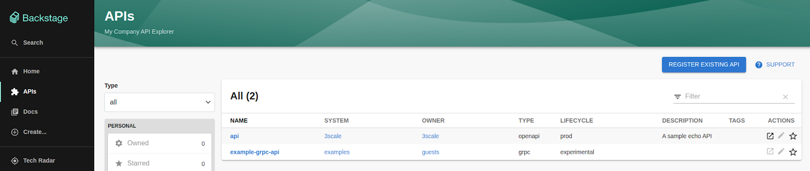

# Exposing your 3scale APIs through the Backstage catalog

Backstage has many features that come out of the box; one of which is the API catalog. The API catalog is responsible for displaying [API entities](https://backstage.io/docs/features/software-catalog/system-model#api), which are defined in YAML format and can be stored on a git repository and used as a source to register API entities in the catalog.

But, what happens when you already have an API Manager like [3scale](https://www.redhat.com/en/technologies/jboss-middleware/3scale) that handles your API definitions? To better integrate 3scale and Backstage, the Janus community developed a [3scale backend plugin](https://github.com/janus-idp/backstage-plugins/tree/main/plugins/3scale-backend) that imports APIs from 3scale into the Backstage catalog as API entities.

## Installation

With this plugin, your APIs from multiple 3scale tenants will be available in the Backstage catalog API entities.

The first step is to install the backend plugin. Navigate to the root directory of your Backstage instance and run the following command to add the plugin.

```bash
yarn workspace backend add @janus-idp/backstage-plugin-3scale-backend
```

### Configuration

The 3scale Backstage plugin allows configuration of one or many providers using the `app-config.yaml` configuration file. Use a `threeScaleApiEntity` marker to start configuring them:

```yaml filename="app-config.yaml" {2-11}
catalog:
  providers:
    threeScaleApiEntity:
      dev:
        baseUrl: https://<TENANT>-admin.3scale.net
        accessToken: <ACCESS_TOKEN>
        schedule: # optional; same options as in TaskScheduleDefinition
          # supports cron, ISO duration, "human duration" as used in code
          frequency: { minutes: 1 }
          # supports ISO duration, "human duration" as used in code
          timeout: { minutes: 1 }
```

Add the 3scale entity provider to the catalog builder at `packages/backend/src/plugins/catalog.ts`, once done, the catalog plugin should be able to load 3scale products as entities in the Backstage catalog:

```tsx filename="packages/backend/src/plugins/catalog.ts" {1,7-12}
import { ThreeScaleApiEntityProvider } from '@janus-idp/backstage-plugin-3scale-backend';

/ ..
  const builder = await CatalogBuilder.create(env);

  /** ... other processors and/or providers ... */
  builder.addEntityProvider(
    ThreeScaleApiEntityProvider.fromConfig(env.config, {
      logger: env.logger,
      scheduler: env.scheduler
    }),
  );

  const { processingEngine, router } = await builder.build();
/ ..
```

### Verify

Now your API entities will be available in the Backstage catalog.



## Next steps

To contribute to this plugin, report issues, or provide feedback, visit our [GitHub repository](https://github.com/janus-idp/backstage-plugins/tree/main/plugins/3scale-backend) or contact us on the [Janus IDP Slack](https://join.slack.com/t/janus-idp/shared_invite/zt-1pxtehxom-fCFtF9rRe3vFqUiFFeAkmg).  Learn more about other Backstage plugins in the Janus community [here](https://github.com/janus-idp/backstage-plugins).