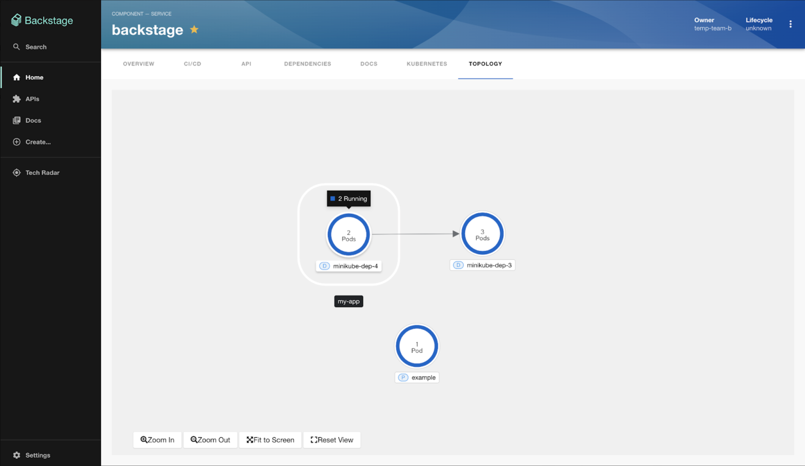

# Topology plugin coming soon to a Backstage near you!

The Janus community is thrilled to share details about our Backstage Topology Plugin. This powerful new tool simplifies the process of visualizing k8s workloads of your Backstage services. With this plugin, developers can get a clear and concise overview of their application's structure and workload status. This eliminates the stress and cognitive overload that often comes with working with Kubernetes.

With the Backstage Topology Plugin, you will be able to see a graphical visualization of your backstage service’s workloads and their pods statuses across clusters in real-time with the ability to filter workloads by a specific cluster. 

So, what makes the Backstage Topology Plugin so special? For starters, it offers a range of powerful features other than providing a graphical visualization of k8s workloads and that includes providing one click access to the running application, functionality to group workloads in multiple sets, ability to connect nodes to each other to represent their relationships with each other and providing a way to look into the details of the workload and its related resources. 

And best of all, the Backstage Topology Plugin is incredibly easy to use. Its intuitive interface and straightforward design mean that you won't have to waste time figuring out how to use it or struggling with complex settings. Instead, you can focus on getting your work done quickly and efficiently.

## Next steps

Be on the lookout for a more in depth overview of the Backstage Topology Plugin soon!

Learn more about other Backstage plugins in the Janus community [here](https://github.com/janus-idp/backstage-plugins) or join us on the [Janus IDP Slack](https://join.slack.com/t/janus-idp/shared_invite/zt-1pxtehxom-fCFtF9rRe3vFqUiFFeAkmg)! 
