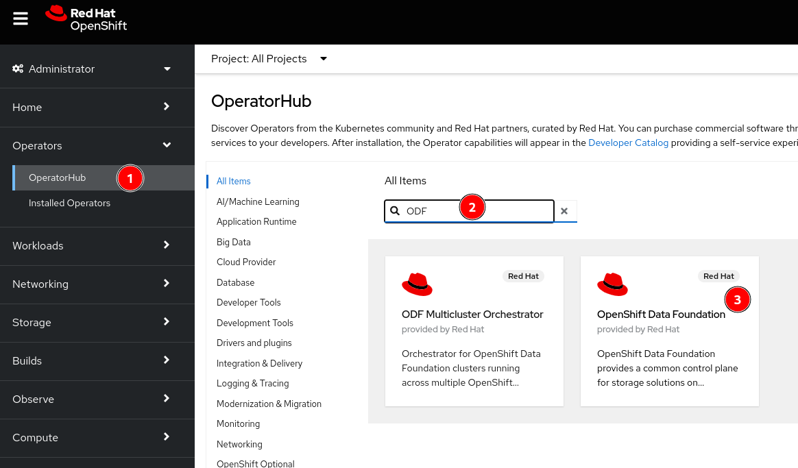
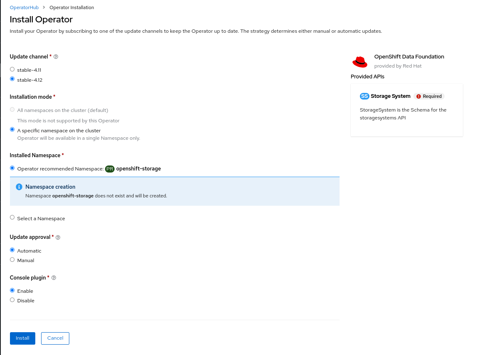
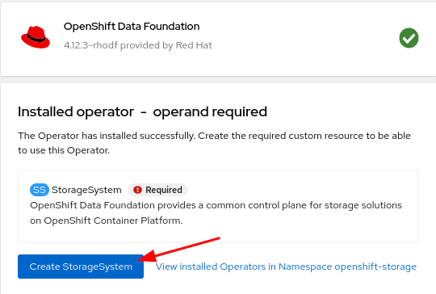
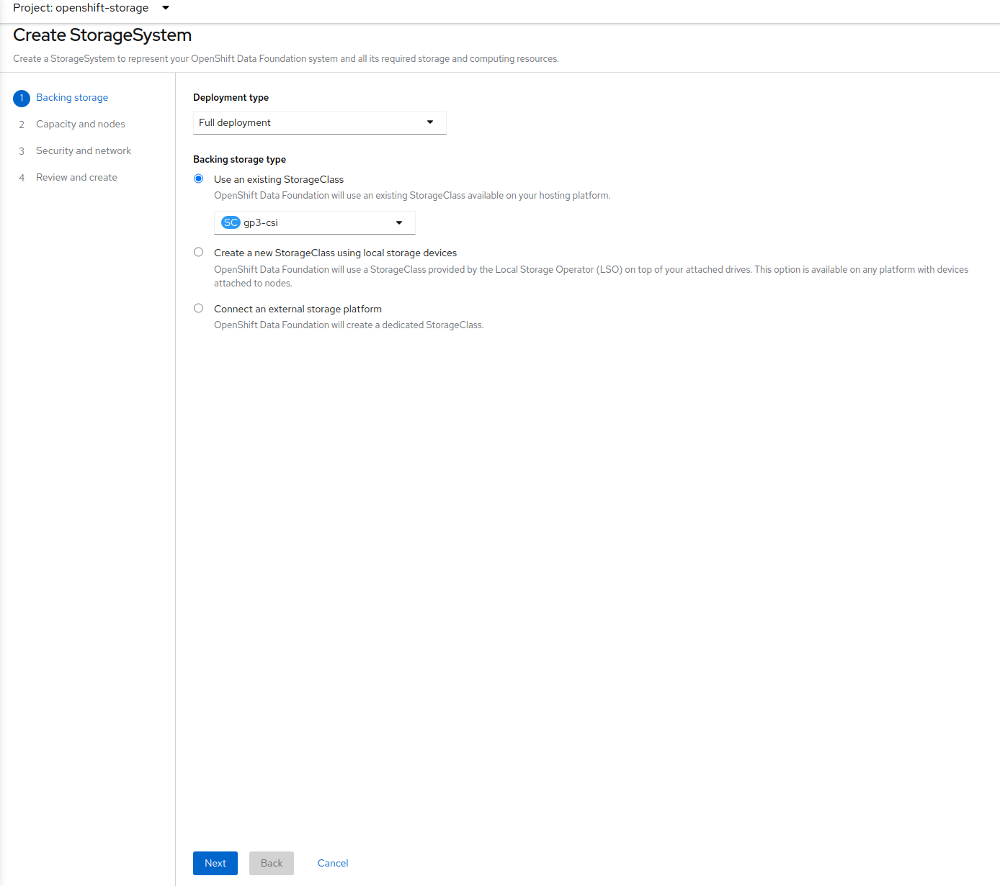
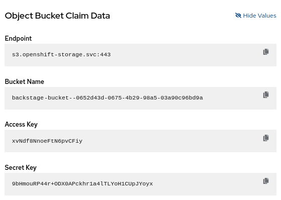

# Recommended Approach to Configuring Tech Docs for Backstage on OpenShift

Backstage includes a built-in techdocs builder that can be used to generate static HTML documentation from your codebase. However, the default basic setup of the "local" builder is not intended for production. This is because the local builder requires that you have a running instance of Backstage and the techdocs plugin installed on your local machine, as well as the use of local storage.

In this blog post, we will show you the recommended approach to streamlining the configuration of TechDocs for Backstage on OpenShift. We will show you how to set up a fully-automated process for building and publishing techdocs using GitHub Actions and the OpenShift Data Foundations operator. This will allow you to create an `ObjectBucketClaim` that mimics an AWS S3 Bucket, which can then be used to store and serve your techdocs.

## OpenShift Data Foundation (ODF) Installation

The TechDocs publisher stores generated files in Cloud Storage (Google GCS, AWS S3, Azure Blob Storage) or local storage. OpenShift Data Foundations (ODF) provides a custom resource called the `ObjectBucketClaim`, which can be used to request an S3 compatible bucket backend. To use this feature, you must install the ODF operator.

We can install this using the OperatorHub from the OpenShift Web Console



1. Navigate to the Operators -> OperatorHub menu
2. Type `ODF` in the **Filter by keyword...** box
3. Select the `OpenShift Data Foundation` operator and then select **Install**

Keep the default settings as shown below:



Click **Install**.

:::note
The operator can take several minutes to complete.
:::

Once complete click the **Create StorageSystem** button.



:::note
If the **Create StorageSystem** screen does not look like the screenshot below, wait a few minutes for the operator pods to start running. You can check the status of the pods in the `openshift-storage` namespace and wait for them to change to a `Running` state.
:::



Take all the default settings. When you reach the **Capacity and nodes** section make sure to select at least 3 nodes, preferably in 3 different zones.

### ObjectBucketClaim Creation

Once the StorageSystem is complete use the following yaml to create an `ObjectBucketClaim` in the same namespace Janus is installed:

```yaml title="obc.yaml"
apiVersion: objectbucket.io/v1alpha1
kind: ObjectBucketClaim
metadata:
  name: backstage-bucket-claim
spec:
  generateBucketName: backstage-bucket-
  storageClassName: openshift-storage.noobaa.io
```

:::note
It may take a few minutes after the StorageSystem is complete in order for the OBC to be fully created. If the status of the OBC is `Lost` just wait a few minutes.
:::

Once you have completed the steps, your `ObjectBucketClaim` will be ready for use. You can confirm this by checking the **Claim Data** section as seen below from the OpenShift Web Console.



## Configuring Backstage

Once the ODF Operator is installed and an `ObjectBucketClaim` is created, Backstage can be configured to use the `ObjectBucketClaim` as the TechDocs publisher.

### Deployment

Update the Backstage `Deployment` to include the following:

```yaml
envFrom:
  - configMapRef:
      name: backstage-bucket-claim
  - secretRef:
      name: backstage-bucket-claim
env:
  - name: BUCKET_URL
    value: 'VALUE_OF_S3_ROUTE_LOCATION'
  - name: AWS_REGION
    valueFrom:
      configMapKeyRef:
        name: backstage-bucket-claim
        key: BUCKET_REGION
```

Both a `Secret` and a `ConfigMap` are created with the same name and include information that Backstage needs to connect to the `ObjectBucketClaim` in order to read the TechDoc files.

The `VALUE_OF_S3_ROUTE_LOCATION` variable above will need to be replaced. To do this, run the following command and replace with the output:

```bash
oc get route s3 -n openshift-storage -o jsonpath='https://{.spec.host}'
```

The AWS Region is empty in this case because we are using OpenShift Data Foundation (ODF). Backstage will fail to start if we set this value to an empty string. By default, Backstage will look for an environment variable named `AWS_REGION` if no region is specified in the `app-config.yaml` file. This is why we are not setting this value in the `app-config.yaml` and setting the `AWS_REGION` from the `ConfigMap` instead.

### Application Configuration

Update the app-config.yaml file to look like the following:

```yaml title="app-config.yaml"
techdocs:
  builder: 'external'
  generator:
    runIn: 'local'
  publisher:
    type: 'awsS3'
    awsS3:
      bucketName: ${BUCKET_NAME}
      endpoint: ${BUCKET_URL}
      s3ForcePathStyle: true
      credentials:
        accessKeyId: ${AWS_ACCESS_KEY_ID}
        secretAccessKey: ${AWS_SECRET_ACCESS_KEY}
```

:::note
If you are using Janus Backstage Showcase image, you will also need add the following to the `app-config.yaml` file:

```yaml title="app-config.yaml"
enabled:
  techdocs: true
```

:::

## TechDocs Builder

To generate the static files that will be published to our `ObjectBucketClaim`, we will need to set up a builder that utilizes the techdocs-cli. We can do this by creating a GitHub Action similar to the one found below. As you can see, this will run anytime the `mkdocs.yaml` file is modified or any file in the `docs` folder is modified. This will regenerate the static content, so that users always have access to the latest documentation.

```yaml title="techdocs.yaml"
name: Publish TechDocs Site

on:
  push:
    branches:
      - main
    paths:
      - 'docs/**'
      - 'mkdocs.yaml'

jobs:
  publish-techdocs-site:
    name: Publish techdocs site
    runs-on: ubuntu-latest

    env:
      TECHDOCS_S3_BUCKET_NAME: ${{ secrets.BUCKET_NAME }}
      AWS_ACCESS_KEY_ID: ${{ secrets.AWS_ACCESS_KEY_ID }}
      AWS_SECRET_ACCESS_KEY: ${{ secrets.AWS_SECRET_ACCESS_KEY }}
      AWS_REGION: ${{ secrets.AWS_REGION }}
      AWS_ENDPOINT: ${{ secrets.AWS_ENDPOINT }}
      ENTITY_NAMESPACE: 'default'
      ENTITY_KIND: 'Component'
      ENTITY_NAME: 'BACKSTAGE_COMPONENT_NAME'

    steps:
      - name: Checkout code
        uses: actions/checkout@v3
        with:
          fetch-depth: 0

      - name: Setup Node
        uses: actions/setup-node@v3
        with:
          node-version-file: '.nvmrc'
          cache: 'yarn'

      - name: Setup Python
        uses: actions/setup-python@v4
        with:
          python-version: '3.9'

      - name: Install techdocs-cli
        run: sudo npm install -g @techdocs/cli

      - name: Install mkdocs and mkdocs plugins
        run: python -m pip install mkdocs-techdocs-core==1.*

      - name: Generate docs site
        run: techdocs-cli generate --no-docker --verbose

      - name: Publish docs site
        run: techdocs-cli publish --publisher-type awsS3 --storage-name $TECHDOCS_S3_BUCKET_NAME --awsEndpoint $AWS_ENDPOINT --awsS3ForcePathStyle --entity $ENTITY_NAMESPACE/$ENTITY_KIND/$ENTITY_NAME
```

:::note
Replace `BACKSTAGE_COMPONENT_NAME` with the name of the Backstage component
:::

Although the default basic setup of the "local" builder in Backstage is a valuable starting point for development and testing, it is crucial to transition to an external builder and utilize a Cloud Storage provider to create a resilient and scalable solution for production environments. By doing so, we can guarantee optimal performance, reliability, and streamlined management of documentation within Backstage.

## Resources

- Complete [ODF Operator](https://red-hat-storage.github.io/ocs-training/training/ocs4/odf.html#labexercises) configuration and installation
- Backstage.io [TechDocs](https://backstage.io/docs/features/techdocs/) documentation
- [Deploying Backstage onto OpenShift Using Helm](blog/2023-02-17-deploying-backstage-onto-openshift-using-helm/index.mdx)
- [Janus Backstage Images](blog/2023-03-01-janus-backstage-images-on-quay/index.mdx)
