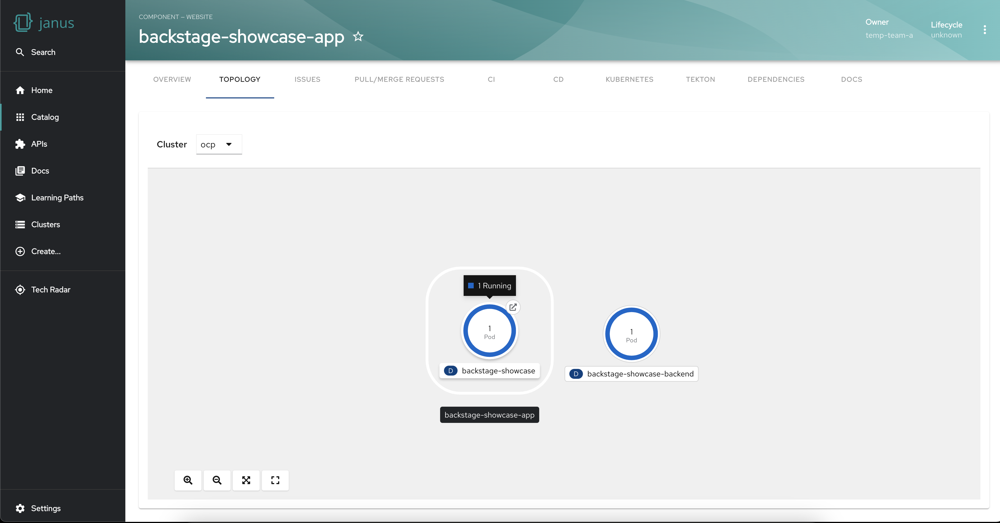
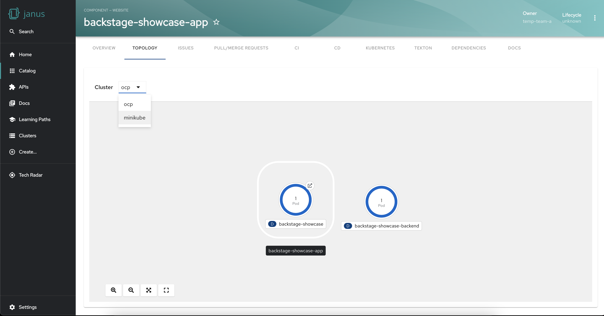

import ArchiveBanner from 'ui/components/banner/archive-banner';

<ArchiveBanner />

# Exploring the Backstage Topology Plugin

The Janus community recently released the Backstage Topology plugin which provides an intuitive way to visualize and understand the workloads running on your Kubernetes cluster.
Currently, the plugin is read-only, allowing you to view and analyze the workload distribution across clusters without making any modifications.

The intuitive graphical representation provides an at-a-glance understanding of the workload distribution across clusters, enabling you to spot issues or imbalances quickly. Whether it's Deployments, Jobs, Daemonsets, Statefulsets, CronJobs, or Pods, this plugin lets you gain insights into the components powering your applications or services.



We introduced the plugin in the previous [blog](/blog/2023/03/06/topology/) so in this blog post, we will explore the unique features, installation, and usage of the Topology plugin in Backstage.

The Backstage Topology Plugin provides a lot of powerful features going beyond the graphical visualization of Kubernetes workloads. Let's explore the various features that make this plugin outstanding:

### Filter workloads by cluster

The plugin empowers you to visualize the workloads of a specific cluster when your workloads are spread across multiple clusters. This functionality allows you to focus on a particular environment or segment of your application infrastructure. This targeted filtering capability makes issue troubleshooting easier and can help with the optimization of resources.




### Group workloads

Visualizing workloads into logical sets is made easy with the Topology Plugin. By grouping related workloads, you can manage them collectively, enabling efficient monitoring, scaling, and resource allocation.

To display workloads in a visual group add the following label to your workloads:

```yaml
labels:
  app.kubernetes.io/part-of: <GROUP_NAME>
```


### Establish node Connections and Relationships

The plugin facilitates the establishment of connections between nodes to represent their relationships. This feature enhances your understanding of the dependencies and interactions between different workloads, fostering a comprehensive view of your infrastructure.

To display workloads with visual connectors add the following annotation to your target workloads:

```yaml
annotations:
  app.openshift.io/connects-to: '[{"apiVersion": <RESOURCE_APIVERSION>,"kind": <RESOURCE_KIND>,"name": <RESOURCE_NAME>}]'
```


### Access the application in a single click

The Topology Plugin simplifies access to the running application associated with your workloads. With a single click, you can easily navigate to the relevant application, saving time and effort.


### Get workload insights using the side panel

The plugin also provides a side panel that opens up on selecting a workload. The side panel shows the details of the workload and its connected resources. This level of granularity helps troubleshoot issues, find bottlenecks and fine-tune your workload configurations.


## Installation and configuration

To start leveraging the capabilities of the Backstage Topology Plugin, follow these steps for installation and configuration:

1. Install the prerequisite Kubernetes plugin, including `@backstage/plugin-kubernetes` and `@backstage/plugin-kubernetes-backend`, by following the provided [installation](https://backstage.io/docs/features/kubernetes/installation) and [configuration](https://backstage.io/docs/features/kubernetes/configuration) guides.

2. Configure the Kubernetes plugin to connect to your cluster using a `ServiceAccount`. Ensure that the `ServiceAccount` accessing the cluster has the necessary [ClusterRole](https://backstage.io/docs/features/kubernetes/configuration#role-based-access-control) granted. If you have the Backstage Kubernetes plugin configured, the `ClusterRole` is likely already granted.

3. Annotate the entity's `catalog-info.yaml` file to identify whether an entity contains Kubernetes resources:

   ```yaml
   annotations:
     backstage.io/kubernetes-id: <BACKSTAGE_ENTITY_NAME>
   ```

4. Optionally, add the `backstage.io/kubernetes-namespace` annotation to identify Kubernetes resources using the defined namespace:

   ```yaml
   annotations:
     backstage.io/kubernetes-namespace: <RESOURCE_NS>
   ```

5. Add a custom label selector to help Backstage find the Kubernetes resources. This label selector takes precedence over the ID annotations:

   ```yaml
   annotations:
     backstage.io/kubernetes-label-selector: 'app=my-app,component=front-end'
   ```

6. Label the resources with the following label to allow the Kubernetes plugin to retrieve the Kubernetes resources from the requested entity:

   ```yaml
   labels:
     backstage.io/kubernetes-id: <BACKSTAGE_ENTITY_NAME>
   ```

   **Note:** When using the label selector, ensure that the mentioned labels are present on the resource.

7. Install the Topology plugin using the following command:
   ```console
   yarn workspace app add @janus-idp/backstage-plugin-topology
   ```

### Enabling Topology plugin in Backstage app

Now that the Topology plugin is installed and configured, to leverage the Backstage Topology Plugin within your Backstage application, enable the plugin in UI by adding the following code to this file `packages/app/src/components/catalog/EntityPage.tsx`:

```javascript
import { TopologyPage } from '@janus-idp/backstage-plugin-topology';

const serviceEntityPage = (
  <EntityPageLayout>
    {/* ... */}
    <EntityLayout.Route path="/topology" title="Topology">
      <TopologyPage />
    </EntityLayout.Route>
  </EntityPageLayout>
);
```

### Using the Topology plugin in Backstage

Now that the plugin is fully set up, once you open your Backstage application and select an entity from the Catalog page, you should see a Topology tab on the entity page. Go to the Topology tab and you will be presented with a graphical view of your service’s workloads.

## Next Steps

The Backstage Topology Plugin is a game-changer for managing Kubernetes workloads, offering a range of powerful features designed to simplify visualization, organization, and monitoring. We are also working on adding more cool new features to this plugin so be sure to keep an eye out for the latest updates.

To contribute to this plugin, report issues, seek guidance or provide feedback, please see our GitHub repository [https://github.com/janus-idp/backstage-plugins/tree/main/plugins/topology](https://github.com/janus-idp/backstage-plugins/tree/main/plugins/topology).
