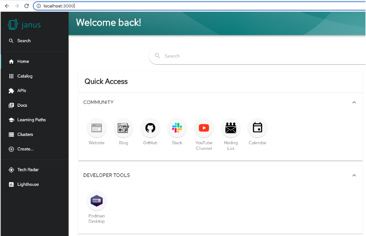
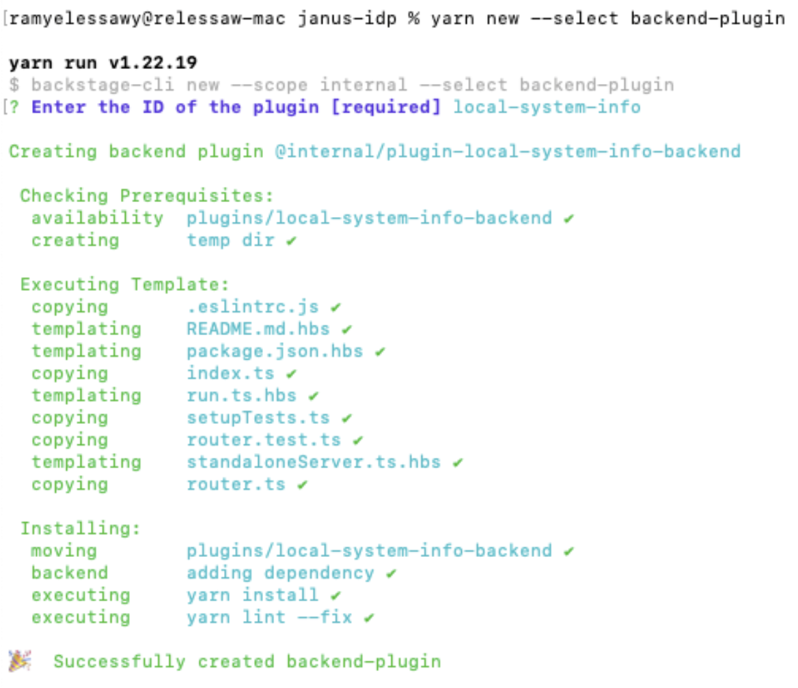
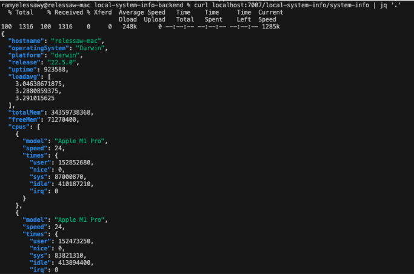
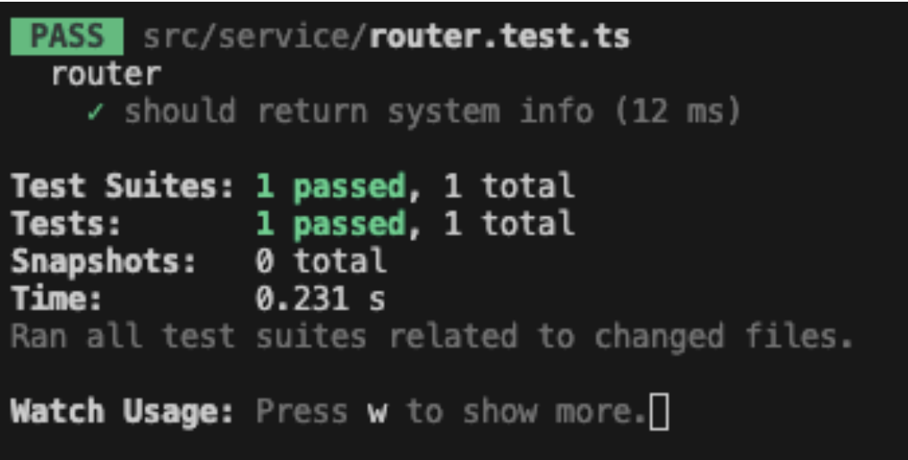

# Creating your first Backstage Backend plugin 

## Introduction

Plugins are the heart and soul of Backstage. They are the building blocks that make up the functionality of a Backstage app.  Whether you want to integrate with your favorite tools or create new features, plugins allow you to create a personalized experience in Backstage.

Backend plugins are crucial in providing the necessary data and performing backend operations. They typically expose a REST API that frontend plugins can call, and they might also interact with databases, external APIs, or other resources. They are essential for enabling the full functionality of a Backstage app, allowing frontend plugins to be more than just static pages - they can be dynamic, interactive, and integrated with your existing infrastructure.

In this blog post, we'll guide you through creating a backend plugin for Backstage. We'll lay the groundwork for a **Local System Information** plugin, creating a backend plugin that fetches information about the local system, like CPU usage, memory usage, and disk space.  In the second part of this blog, we'll build upon this foundation and create the frontend plugin to interact with it. Let's get started!

## Understanding Backstage Backend

Before we dive into creating a backend plugin, it's important to understand the structure of the Backstage backend and the technologies it uses.

### Backstage Backend Structure

The Backstage backend is a standalone, separate component from the frontend. It's designed to be a monolithic server that hosts all the backend plugins. Each plugin is its own isolated piece of code, but they all run in the same server process. This allows plugins to share common features and utilities while still keeping their codebases separate and focused.

The backend is structured around a core backend package, `@backstage/backend-common`, which provides common utilities and interfaces. Backend plugins are then added to the backend by creating a new instance of the plugin class and adding it to the backend's router.

### Backend Router

The backend router is responsible for routing incoming HTTP requests to the appropriate backend plugin. Each backend plugin is essentially an Express router that gets mounted onto the main Express app.

When you create a new backend plugin, you define a new Express router. This router defines the API endpoints for your plugin, and it's where you implement the logic for handling incoming requests.


### Role of NodeJS and Express in the Backstage Backend

The Backstage backend is built using Node.js, a JavaScript runtime that allows you to run JavaScript on the server. Node.js is event-driven and non-blocking, making it well-suited to serve inherently asynchronous web requests.

Express is a minimal and flexible Node.js web application framework that provides robust features for web and mobile applications. It's used as the web server framework in the Backstage backend.

In the context of our **Local System Information** plugin, the backend plugin will be an Express router that exposes a REST API for fetching system information. The frontend plugin will then call this API to fetch the needed data.

## Setting Up Your Environment

We need to set up our development environment before we can start creating our backend plugin. Here's a step-by-step guide on how to do this:

### Step 1: Install Node.js and Yarn

The first step is to install Node.js and Yarn. Node.js is the JavaScript runtime the Backstage backend runs on, and Yarn is the package manager Backstage uses.

You can download Node.js from the [official website](https://nodejs.org/). Backstage requires Node.js version 14 or later. After installing Node.js, you can install Yarn by running the following command in your terminal.
```bash
npm install -g yarn
``` 

### Step 2: Clone the Janus-Showcase Repository

In this tutorial, we will use Red Hat’s [Project Janus](https://janus-idp.io/) to explain the steps for building our backend plugin. So the next step is to clone the Janus-Showcase repository. To clone the repository, run the following command in your terminal.
```bash
git clone https://github.com/janus-idp/backstage-showcase
``` 
 Then, navigate into the cloned repository by running 
```bash
cd backstage-showcase
``` 

### Step 3:  Start the Janus IDP Backend

Once you've cloned the repository, you need to install its dependencies. You can do this by running the following command in your terminal.
```bash
yarn install
```  

When writing this blog, Janus IDP requires yarn version 1; check your current version using the command 
```bash
yarn --version
```  
If needed set the yarn version using this command 
```bash
yarn set version 1.22.19
```  

Finally, you can start the Janus-Showcase application. To do this, navigate into the folder you cloned (backstage-showcase), then run the start command in iyour terminal.
```bash
yarn start
```   
This will start the Janus-Showcase backend running at http://localhost:3000/



With your environment set up, you're ready to start creating your backend plugin. In the next section, we'll guide you through creating a new backend plugin.

## Creating a Backend Plugin

Now that we've set up our development environment, we can start creating our backend plugin. In this section, we'll guide you through creating a new backend plugin using the Backstage CLI and explain the structure of the newly created plugin.

### Creating a Backend Plugin Using the Backstage CLI

The Backstage CLI provides a command for creating a new backend plugin. To create a new backend plugin, navigate to the directory backstage-showcase, and in your terminal, run the following command:
```bash
yarn new --select backend-plugin
``` 

You'll be asked to supply a name for the plugin. This is an identifier that will be part of the NPM package name; you might choose an ID like **local-system-info**.



### Structure of the Newly Created Plugin

When you create a new backend plugin using the `yarn new --select backend-plugin` command, the Backstage CLI does a few things behind the scenes to wire up the plugin to your Backstage app. 

The CLI adds a new entry to the dependencies section of the **package.json** file in the `packages/backend` directory. This entry points to your new plugin, effectively installing it as a dependency of your Backstage app.

The CLI also creates a new directory for your plugin under the `plugins/` directory. In our example, the CLI creates the directory `backstage-showcase/plugins/local-system-info-backend` containing the code for your plugin. Here's a brief overview of the structure of a newly created backend plugin:

- `src/`: This directory contains the source code for your plugin. It includes an `index.ts` file, which is the entry point for your plugin and exports a function that creates an instance of your plugin's router. This function  is called by the Backstage backend when it starts up.

- `src/service/`: This directory contains the `router.ts` file, which defines the router for your plugin and the `router.test.ts` file. This file contains a sample test for your plugin's router. 

- `package.json`: This file defines the metadata and dependencies for your plugin. It includes the name of your plugin, its version, dependencies, and various configuration options. The `main` field points to the `src/index.ts` file, which is the entry point for your plugin.

In the context of our **Local System Information** plugin, the `router.ts` file will define a REST API for fetching system information, and the `index.ts` file will export a function that creates an instance of this router. In the next section, we'll start implementing our backend plugin by defining its API.

## Implementing the Plugin API

Now that we have our plugin structure in place, it's time to implement the API for our plugin. This is where we define the endpoints our frontend plugin will call to fetch the system information. In this section, we'll guide you through defining these endpoints and implementing the logic for fetching the system information.

### Defining API Endpoints in the router.ts File

The first step in implementing our plugin API is to define the endpoints in our `router.ts` file. This file is where we define an Express router for our plugin, and it's where we define the routes for our API.

Here's an example of what our `router.ts` file might look like:

```
import express from 'express';
import os from 'os';

export function createRouter(): express.Router {
  const router = express.Router();

  router.get('/system-info', (req, res) => {
    const systemInfo = {
      hostname: os.hostname(),
      operatingSystem: os.type(),
      platform: os.platform(),
      release: os.release(),
      uptime: os.uptime(),
      loadavg: os.loadavg(),
      totalMem: os.totalmem(),
      freeMem: os.freemem(),
      cpus: os.cpus(),
    };

    res.send(systemInfo);
  });

  return router;
}
```

In this example, we define a single GET endpoint at `/system-info`. When this endpoint is accessed, it fetches the system information using Node.js's built-in `os` module. The `os` module provides several methods for fetching system information, such as `os.hostname()` for fetching the hostname, `os.type()` for fetching the operating system type, and `os.totalmem()` for fetching the total memory.

We call these methods to fetch the system information, and then we send this data in the response using `res.send(systemInfo)`.

With this, we have a fully functional backend plugin that fetches and provides system information. In the next section, we'll guide you through testing your plugin and ensuring everything works as expected.

## Testing Your Backend Plugin

After implementing the API for your plugin, testing it to ensure it works as expected is important. In this section, we'll guide you through the process of testing your backend plugin.

### Standalone mode - Light Testing

A backend plugin can be started in a standalone mode. You can do a first-light test of your service:

```bash
cd plugins/local-system-info-backend/ 
yarn start
```

After a few seconds, the plugin will be built successfully, and the backend will listen on port 7007. In a different terminal window, now run the following command:

```bash
curl localhost:7007/local-system-info/system-info | jq '.'
```



### Testing using Jest functions

Backstage uses Jest as its testing framework so that you can use any Jest functions in your tests. Replace the content of the `router.test.ts` file in the `src/service` directory with the following:

```
import request from 'supertest';
import express from 'express';
import { createRouter } from './router';

describe('router', () => {
  const app = express();
  app.use(createRouter());

  it('should return system info', async () => {
    const response = await request(app).get('/system-info');

    expect(response.status).toBe(200);
    expect(response.body).toHaveProperty('hostname');
    expect(response.body).toHaveProperty('operatingSystem');
    expect(response.body).toHaveProperty('platform');
    // ... add more assertions as needed
  });
});
```

In this example, we're using the supertest library to send a GET request to our `/system-info` endpoint, and then we're using Jest's expect function to assert that the response has a status of 200 and includes the expected properties.

Now, you can run your test using the the following command from the directory `/plugins/local-system-info-backend`.
```bash
yarn test 
```
This will run Jest, which will find and run all tests in your router.test.ts file. 



## Conclusion

Congratulations! You've just created your first Backstage backend plugin. You've learned about the structure of the Backstage backend. You've also walked through creating a backend plugin using the Backstage CLI and implemented a REST API for your plugin.

In this tutorial, we've created a **Local System Information** plugin that fetches and provides system information. This is a simple yet powerful example of what you can achieve with Backstage backend plugins. 

Remember, the power of Backstage comes from its extensibility. With plugins, you can integrate your existing tools and services or create entirely new features tailored to your needs. Don't be afraid to experiment and create your own plugins!
