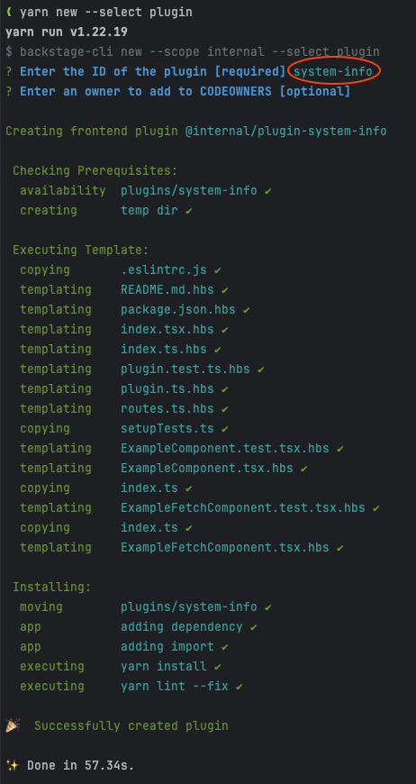
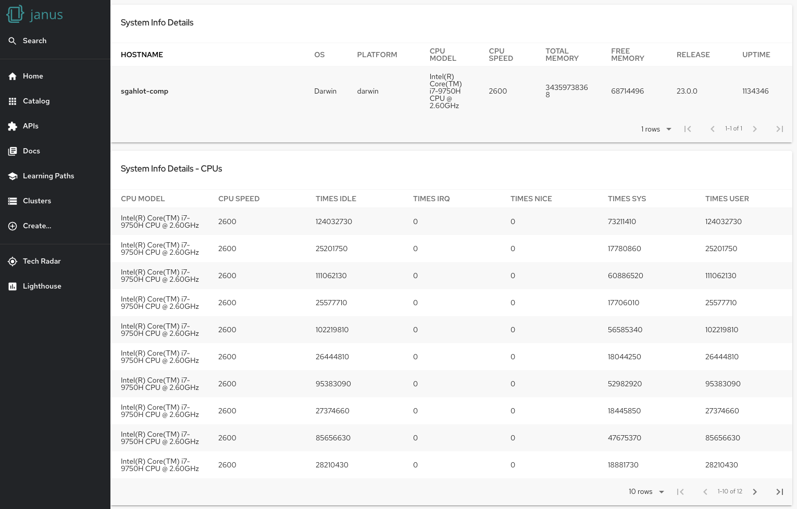

import ArchiveBanner from 'ui/components/banner/archive-banner'

<ArchiveBanner />

# Creating a Backstage Frontend plugin and integrating it with a Backend plugin

## Introduction

This blog will provide information on how we can create a Backstage Frontend plugin as well integrating it with an existing Backstage Backend plugin. The Backend plugin we will use in this article will be the Local System Information plugin mentioned in another [blog](/blog/2023/08/23/creating-your-first-backstage-backend-plugin).

We will make some [modifications to the backstage backend](#modifying-the-backstage-backend) to wire the backend plugin into the Backstage app and then move on to [create a new frontend plugin](#creating-the-frontend-plugin). Once everything is in place and we have verified the frontend plugin integration with the backend plugin, we will then [analyze the code](#analyzing-the-code) that makes it possible.

### Prerequisites

To start, please make sure that the following tasks have already been performed:

- [Run Backstage Showcase locally](https://github.com/janus-idp/backstage-showcase/blob/main/showcase-docs/getting-started.md#running-locally-with-a-basic-configuration)
- [Created the Local System Information backend plugin](/blog/2023/08/23/creating-your-first-backstage-backend-plugin)
  - We will refer to this plugin as _backend plugin_ for the remainder of this article.

---

## Modifying the Backstage backend

The backend plugin exposes the `/system-info` endpoint that is only available using curl, and is not accessible through the Backstage app by any Frontend plugin. To expose and make use of this backend plugin in our app, we will need to wire the plugin's router into the Backstage backend router.

### Exporting the backend plugin router

- Create a new file named `packages/backend/src/plugins/local-system-info.ts` with the following content:

  ```ts title="packages/backend/src/plugins/local-system-info.ts"
  import { createRouter } from '@internal/plugin-local-system-info-backend';
  import { Router } from 'express';
  import { PluginEnvironment } from '../types';

  export default async function createPlugin(env: PluginEnvironment): Promise<Router> {
    return await createRouter({
      logger: env.logger,
    });
  }
  ```

- Wire the backend plugin router into the Backstage backend router by modifying `packages/backend/src/index.ts`:

  - Import the newly added file for our backend plugin into the `packages/backend/src/index.ts`.
  - Then add the plugin into the backend by adding the following line into the `main` function after the existing `addPlugin` calls.

    ```ts title="packages/backend/src/index.ts" showLineNumbers {3,10}
      import ...
      ...
      import sysInfo from './plugins/local-system-info';
      ...
      ...
      async function main() {
        ...
        await addPlugin({ plugin: 'search', apiRouter, createEnv, router: search });

        await addPlugin({plugin: 'sys-info', apiRouter, createEnv, router: sysInfo,});
        ...
      }
    ```

### Modifying the `package.json` to run the backend plugin

The command to start the Backstage (`yarn start`) starts both the app and backend as well as any other workspaces found in the `plugins` directory, which also includes our new backend plugin.

Ideally, one would want to publish the backend and frontend plugins and then simply install that plugin to use it. But since we are setting up both the backend and frontend plugins in our local development environment, the `yarn start` command will try to start the app and the backend plugin along with the Backstage backend. Both the backend plugin as well as Backstage backend processes listen on port `7007`. This will cause a port conflict when the Backstage app starts.

To resolve this issue, we can either modify the `package.json` in the root directory to add a new script to only run the app and backend, or run two commands to start the app and backend separately.

#### Modifying the `package.json`

Modify the `package.json` in the root directory by adding the following content in the `scripts` section (_just after the `start` script entry_):

```json title="package.json" showLineNumbers {7}
{
  "name": "root",
  ...
  "scripts": {
    ...
    "start": "turbo run start --parallel",
    "start-dev": "turbo run start --filter=app --filter=backend",
    ...
  },
  ...
}
```

#### Alternate method to start Backstage

- In case one does not want to modify the `package.json`, an alternative method to start backstage is to run the following two commands in the root directory of the backstage-showcase repository, in two separate terminals:

```bash
yarn workspace app start
yarn workspace backend start
```

### Modifying the backend plugin response

In the `plugins/local-system-info-backend/src/service/router.ts` file, move all the elements except `cpus` to the `data` element so that it is easier to parse and display in the frontend plugin:

```ts title="plugins/local-system-info-backend/src/service/router.ts" showLineNumbers {2,11}
const systemInfo = {
  data: {
    hostname: os.hostname(),
    operatingSystem: os.type(),
    platform: os.platform(),
    release: os.release(),
    uptime: os.uptime(),
    loadavg: os.loadavg(),
    totalMem: os.totalmem(),
    freeMem: os.freemem(),
  },
  cpus: os.cpus(),
};
```

### Verifying that the backend plugin is available through the Backstage app

To verify the changes done to the backend plugin, run the Backstage backend with `yarn start-backend` in the root directory of the backstage-showcase repository.

Since we have yet to create a frontend plugin, we will still need to use a `curl` command to invoke the backend plugin. However, we will access the endpoint provided by the backstage backend router similar to how it would be accessed by a frontend plugin:

```bash
curl localhost:7007/api/sys-info/system-info | jq
```

- When running in the Backstage backend, it is accessed with a prefix of `/api` (from the cli or app)
- The backend plugin is exposed on the `/sys-info` main route (which matches the plugin name when we registered the plugin in the `packages/backend/src/index.ts` file)
- The API endpoint for providing system information is `/system-info`

After verifying the endpoint, you can now stop the backend by killing the `yarn` process.

---

## Creating the Frontend plugin

To create a new frontend plugin, please execute the following command in the root directory of the backstage-showcase repository in a terminal:

```bash
yarn new --select plugin
```

When prompted to enter the ID of the plugin, please provide `system-info`. Here's the output from running this command in my terminal:



### Verifying the new Frontend plugin

The above command will create a new Backstage frontend plugin and will also add it to the Backstage app. To verify the new plugin, run the app with `yarn start-dev` in the root directory of the backstage-showcase repository, or by following [these steps](#alternate-method-to-start-backstage). Once the app starts up, the new plugin can be verified by navigating to `http://localhost:3000/system-info`

### Integrating the frontend plugin with backend plugin

The newly generated frontend plugin contains some static data that is displayed when navigating to `http://localhost:3000/system-info`. In this section, we will modify the frontend plugin to invoke the backend plugin API and display the data returned by that API.

Please follow the steps given below to achieve this integration:

- Delete the following directories:
  ```
  plugins/system-info/src/components/ExampleComponent
  plugins/system-info/src/components/ExampleFetchComponent
  ```
- Create a new directory named `plugins/system-info/src/components/SystemInfoPage`
- Create a new file named `plugins/system-info/src/components/SystemInfoPage/types.ts` with the following content:

  ```ts title="plugins/system-info/src/components/SystemInfoPage/types.ts" showLineNumbers
  import { TableColumn } from '@backstage/core-components';

  export const sysInfoCpuColumns: TableColumn[] = [
    {
      title: 'CPU Model',
      field: 'model',
    },
    {
      title: 'CPU Speed',
      field: 'speed',
    },
    {
      title: 'Times Idle',
      field: 'times.user',
    },
    {
      title: 'Times IRQ',
      field: 'times.irq',
    },
    {
      title: 'Times Nice',
      field: 'times.nice',
    },
    {
      title: 'Times Sys',
      field: 'times.sys',
    },
    {
      title: 'Times User',
      field: 'times.user',
    },
  ];

  export const sysInfoMainDataColumns: TableColumn[] = [
    { title: 'Hostname', field: 'hostname', highlight: true },
    { title: 'OS', field: 'operatingSystem', width: '10%' },
    { title: 'Platform', field: 'platform', width: '10%' },
    { title: 'CPU Model', field: 'cpuModel', width: '10%' },
    { title: 'CPU Speed', field: 'cpuSpeed', width: '10%' },
    { title: 'Total Memory', field: 'totalMem', width: '20%' },
    { title: 'Free Memory', field: 'freeMem', width: '10%' },
    { title: 'Release', field: 'release', width: '10%' },
    { title: 'Uptime', field: 'uptime', width: '10%' },
  ];

  type CpuData = {
    model: string;
    speed: number;
    times: CpuTimeData;
  };

  type CpuTimeData = {
    idle: number;
    irq: number;
    nice: number;
    sys: number;
    user: number;
  };

  type SysInfoMainData = {
    cpuModel: string;
    cpuSpeed: number;
    freeMem: number;
    hostname: string;
    loadavg: Array<number>;
    operatingSystem: string;
    platform: string;
    release: string;
    totalMem: number;
    uptime: number;
  };

  export type SysInfoData = {
    cpus: Array<CpuData>;
    data: SysInfoMainData;
    mainDataAsArray: SysInfoMainData[];
  };
  ```

- Create a new file named `plugins/system-info/src/components/SystemInfoPage/SystemInfoPage.tsx` with the following content:

  ```tsx title="plugins/system-info/src/components/SystemInfoPage/SystemInfoPage.tsx" showLineNumbers {12-13,18-20,39,41,59,61}
  import React from 'react';
  import useAsync from 'react-use/lib/useAsync';

  import { Table } from '@backstage/core-components';

  import { Box, Grid, Typography } from '@material-ui/core';

  import { configApiRef, useApi } from '@backstage/core-plugin-api';

  import { SysInfoData, sysInfoCpuColumns, sysInfoMainDataColumns } from './types';

  export const SystemInfoPage = () => {
    const config = useApi(configApiRef);
    const SYS_INFO_BACKEND_URL = 'backend.baseUrl';

    const { loading: isSysInfoLoading, value: sysInfoData } =
      useAsync(async (): Promise<SysInfoData> => {
        const backendUrl = config.getString(SYS_INFO_BACKEND_URL);
        const backendApiEndPoint = `${backendUrl}/api/sys-info/system-info`;
        const systemInfoData = await fetch(backendApiEndPoint)
          .then((res) => (res.ok ? res : Promise.reject(res)))
          .then((res) => res.json());

        // To display the main data in a table, prepare the array to contain the ONLY data we have
        systemInfoData.mainDataAsArray = [];
        systemInfoData.mainDataAsArray[0] = systemInfoData.data;
        systemInfoData.mainDataAsArray[0].cpuModel = systemInfoData.cpus[0].model;
        systemInfoData.mainDataAsArray[0].cpuSpeed = systemInfoData.cpus[0].speed;

        return systemInfoData;
      }, []);

    return (
      <>
        <Grid style={{ marginTop: '1rem' }} container spacing={2}>
          <Grid item xs={10}>
            <Table
              title="System Info Details"
              columns={sysInfoMainDataColumns}
              isLoading={isSysInfoLoading}
              data={sysInfoData?.mainDataAsArray || []}
              options={{
                padding: 'dense',
                pageSize: 1,
                emptyRowsWhenPaging: false,
                search: false,
              }}
              emptyContent={
                <Box style={{ textAlign: 'center', padding: '15px' }}>
                  <Typography variant="body1">Backend data NOT found</Typography>
                </Box>
              }
            />
          </Grid>

          <Grid item xs={10}>
            <Table
              title="System Info Details - CPUs"
              columns={sysInfoCpuColumns}
              isLoading={isSysInfoLoading}
              data={sysInfoData?.cpus || []}
              options={{
                padding: 'dense',
                pageSize: 10,
                emptyRowsWhenPaging: false,
                search: false,
              }}
              emptyContent={
                <Box style={{ textAlign: 'center', padding: '15px' }}>
                  <Typography variant="body1">Backend data NOT found</Typography>
                </Box>
              }
            />
          </Grid>
        </Grid>
      </>
    );
  };
  ```

- Create a new file named `plugins/system-info/src/components/SystemInfoPage/index.ts` with the following contents:
  ```ts title="plugins/system-info/src/components/SystemInfoPage/index.ts"
  export { SystemInfoPage } from './SystemInfoPage';
  ```
- Modify `plugins/system-info/src/plugin.ts` by replacing the occurrences of `ExampleComponent` with `SystemInfoPage` (_modified line is highlighted in the code block given below_):

  ```ts title="plugins/system-info/src/plugin.ts" showLineNumbers {15}
  import { createPlugin, createRoutableExtension } from '@backstage/core-plugin-api';

  import { rootRouteRef } from './routes';

  export const systemInfoPlugin = createPlugin({
    id: 'system-info',
    routes: {
      root: rootRouteRef,
    },
  });

  export const SystemInfoPage = systemInfoPlugin.provide(
    createRoutableExtension({
      name: 'SystemInfoPage',
      component: () => import('./components/SystemInfoPage').then((m) => m.SystemInfoPage),
      mountPoint: rootRouteRef,
    }),
  );
  ```

  - Before the change: `import('./components/ExampleComponent').then(m => m.ExampleComponent),`
  - After the change: `import('./components/SystemInfoPage').then(m => m.SystemInfoPage),`

### Verifying the integration between the frontend plugin and backend plugin

Now that the plugin is all set, start the app if it is not already started. In case you see any errors, please restart the app with `yarn start-dev` in the root directory of the backstage-showcase repository, or by following [these steps](#alternate-method-to-start-backstage). Once the app starts up, navigate to `http://localhost:3000/system-info`. This page should provide the **System Info Details** as shown below:



---

## Analyzing the code

With the frontend plugin integrated with the backend plugin and able to fetch the System information data from the backend and display it in the UI, let us go over the code that made it all possible.

The following files were created (or modified) to achieve this task:

- **plugins/system-info/src/components/SystemInfoPage/types.ts**: This file contains the following types that either handle the JSON response coming from the backend plugin or are used as table columns when displaying data:
  - `CpuTimeData`: Type to contain `times` attribute of CPU data from the backend plugin JSON response
  - `CpuData`: Type to contain CPU data from the backend plugin JSON response
  - `SysInfoMainData`: Type to contain data element from the backend plugin JSON response
  - `SysInfoData`: Type to contain `SysInfoMainData` and list (Array) of `CpuData` data
  - `sysInfoCpuColumns`: This is a list of fields that are of type `TableColumn` and are used to display the header for CPU columns.
  - `sysInfoMainDataColumns`: This is a list of fields that are of type `TableColumn` and are used to display the header for main data columns.
    - _The `field` property for each element in the list maps to the field that is used to display data from the object containing data for the table._
- **plugins/system-info/src/components/SystemInfoPage/SystemInfoPage.tsx**: Main file to invoke the backend API and parse/display data on the UI with the main lines highlighted in the code block:
  - Gets the backend baseUrl (`backend.baseUrl`) from the config. This property is automatically configured and is available to the frontend plugin with the use of `configApiRef`
    ```tsx title="plugins/system-info/src/components/SystemInfoPage/SystemInfoPage.tsx"
        const config = useApi(configApiRef);
        ...
        const backendUrl = config.getString(SYS_INFO_BACKEND_URL);
    ```
  - Invokes the backend plugin API (`${backendUrl}/api/sys-info/system-info`) and extracts the JSON from the response as `SysInfoData`
    ```tsx title="plugins/system-info/src/components/SystemInfoPage/SystemInfoPage.tsx" showLineNumbers {2,3}
    const backendUrl = config.getString(SYS_INFO_BACKEND_URL);
    const backendApiEndPoint = `${backendUrl}/api/sys-info/system-info`;
    const systemInfoData = await fetch(backendApiEndPoint)
      .then((res) => (res.ok ? res : Promise.reject(res)))
      .then((res) => res.json());
    ```
  - To display the system information data, we are using the following two table components:
    - The first table uses `sysInfoMainDataColumns` for the columns and `sysInfoData?.mainDataAsArray` for the main data (_`mainDataAsArray` is set after fetching the data from the backend API_).
      ```tsx title="plugins/system-info/src/components/SystemInfoPage/SystemInfoPage.tsx" showLineNumbers {8,10}
          systemInfoData.mainDataAsArray = [];
          systemInfoData.mainDataAsArray[0] = systemInfoData.data;
          systemInfoData.mainDataAsArray[0].cpuModel = systemInfoData.cpus[0].model;
          systemInfoData.mainDataAsArray[0].cpuSpeed = systemInfoData.cpus[0].speed;
          ...
          <Table
            title="System Info Details"
            columns={sysInfoMainDataColumns}
            isLoading={isSysInfoLoading}
            data={sysInfoData?.mainDataAsArray || []}
          >
      ```
    - The second table uses `sysInfoCpuColumns` for the columns and `sysInfoData?.cpus` for the CPU data.
      ```tsx title="plugins/system-info/src/components/SystemInfoPage/SystemInfoPage.tsx" showLineNumbers {3,5}
          <Table
            title="System Info Details - CPUs"
            columns={sysInfoCpuColumns}
            isLoading={isSysInfoLoading}
            data={sysInfoData?.cpus || []}
          >
      ```
  - Exports the `SystemInfoPage` component, which contains the Grid containing the two table components defined above:
    ```tsx title="plugins/system-info/src/components/SystemInfoPage/SystemInfoPage.tsx"
        export const SystemInfoPage = () => {
          ...
        }
    ```
- **plugins/system-info/src/components/SystemInfoPage/index.ts**: exports the `SystemInfoPage` component.
- **plugins/system-info/src/components/SystemInfoPage/plugin.ts**: sets the component used by `systemInfoPlugin` to the `SystemInfoPage` component
  ```ts title="plugins/system-info/src/components/SystemInfoPage/plugin.ts" showLineNumbers {4}
  export const SystemInfoPage = systemInfoPlugin.provide(
    createRoutableExtension({
      name: 'SystemInfoPage',
      component: () => import('./components/SystemInfoPage').then((m) => m.SystemInfoPage),
      mountPoint: rootRouteRef,
    }),
  );
  ```
  - This `SystemInfoPage` is used when we hit the route `/system-info` (set in `packages/app/src/App.tsx`)

---

## Conclusion

We have now created a new Backstage frontend plugin and integrated it with the backend plugin to display the data coming from the backend plugin. We used types to manage the JSON response and display the Table columns. This just scratches the surface of what can be done in a frontend plugin. As the backend plugin is exposing data through REST API, you can return pretty much whatever you need to process and display the result in your frontend plugin.

Hope you enjoyed this blog!!!

---

## Links

- [Run Backstage Showcase locally](https://github.com/janus-idp/backstage-showcase/blob/main/showcase-docs/getting-started.md#running-locally-with-a-basic-configuration)
- [Creating your first Backstage Backend plugin](/blog/2023/08/23/creating-your-first-backstage-backend-plugin)
- [Creating a Frontend Plugin](https://backstage.io/docs/plugins/create-a-plugin/)
