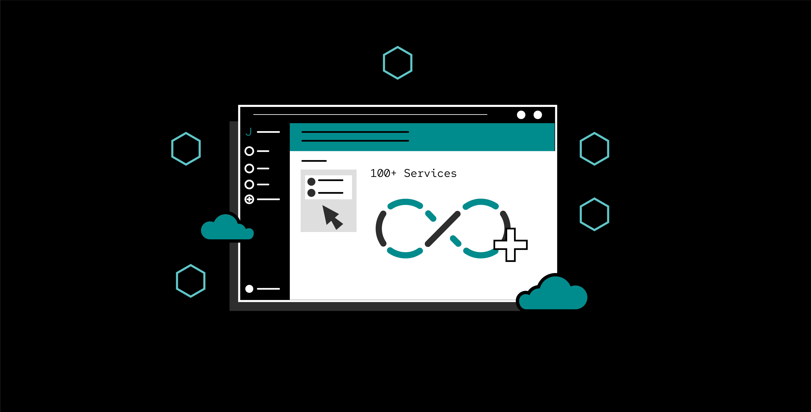

# Community

Janus is an open-source community which relies on contributions from its users. We are always looking for new contributors!

## Join the community

:star: Join our [janus-idp Slack workspace](https://join.slack.com/t/janus-idp/shared_invite/zt-1pxtehxom-fCFtF9rRe3vFqUiFFeAkmg) and join in on our conversations!

:star: Join our [community mailing list](https://groups.google.com/g/janus-idp-community)

:star: Join our community calls! You can view them on our [community calendar](https://calendar.google.com/calendar/u/0?cid=amFudXMuaWRwLmNvbW11bml0eUBnbWFpbC5jb20).

:star: Follow us on [YouTube](https://www.youtube.com/@januscommunity) and catch up on our community meetings!

:star: Follow us on [Twitter](https://www.twitter.com/JanusIDP)!

In all our communications, on whatever platform, we expect everyone to follow a [Code of Conduct](https://github.com/janus-idp/.github/blob/main/CODE_OF_CONDUCT.md).

